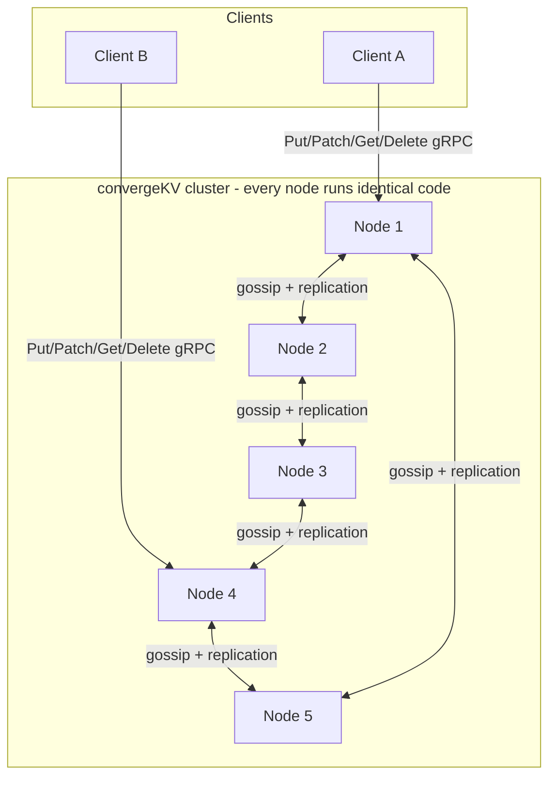
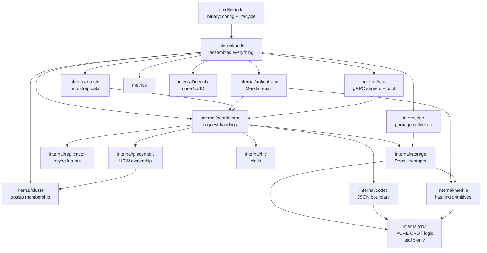

# 1. Overview & Glossary

This chapter gives the shape of the whole system before zooming into any one
part. The glossary at the end collects the recurring terms for later reference.

## The chapters

These chapters build on each other and are ordered so that no term is used
before it is introduced. Each one maps onto a package under `internal/` and
explains both the mechanism and the trade-off behind it.

| # | Chapter | Topic |
|---|---------|-------|
| 1 | Overview & glossary (this chapter) | The big picture, the main design decisions, and a glossary. |
| 2 | [CRDT foundations](02-crdt-foundations.md) | The core data model: dots, causal contexts, version vectors, registers, last-writer-wins, and the merge that makes everything converge. |
| 3 | [Time: hybrid logical clocks](03-clocks-hlc.md) | Why wall-clock time can't order events in a distributed system, and the clock used instead. |
| 4 | [Partitioning & placement](04-partitioning-placement.md) | How keys are spread across nodes (rendezvous hashing) and how every node independently agrees on who owns what. |
| 5 | [Membership & gossip](05-membership-gossip.md) | How nodes discover each other, detect failures, and agree on who is alive — without a central registry. |
| 6 | [Storage engine](06-storage.md) | How a node stores documents on local disk durably, and the on-disk key layout. |
| 7 | [The request paths](07-request-paths.md) | Information flow for a write, a read, and asynchronous replication. |
| 8 | [Anti-entropy (Merkle repair)](08-anti-entropy.md) | How replicas that drifted apart find their differences cheaply and heal — the system's only repair mechanism. |
| 9 | [Cluster changes (transfer)](09-transfer.md) | What happens when a node joins, leaves gracefully, or crashes: rebalancing data. |
| 10 | [Garbage collection & the resurrection problem](10-garbage-collection.md) | Why deletes are the hardest operation in a distributed store, and how deleted data stays dead. |
| 11 | [Node lifecycle & failure handling](11-lifecycle.md) | Startup wiring, graceful and crash shutdown, and the rules for safely rejoining after being away. |

A one-paragraph summary of the whole system: a key is hashed to one of `P` fixed
**partitions**; each partition is owned by **RF = 3** nodes chosen by a hash
function every node computes identically. A write is routed to one of those
owners (the **applier**), which stamps it with a unique **dot**, stores it,
answers the client, and then *asynchronously* pushes the change to the other two
owners. There are no quorums and no waiting. Because network messages get lost, a
background **anti-entropy** process periodically compares owners pairwise using
**Merkle hashes** and repairs any differences. The data model is a **causal
CRDT**, which guarantees that no matter what order messages arrive in, or how
often they are duplicated, all three owners converge to byte-identical state.

## 1.1 The problem being solved

A single database server eventually stops being enough: it can't hold all the
data, and if it dies the whole service goes down. Spreading data over many
machines is the standard answer, with three goals in mind:

1. **Capacity** grows as machines are added (each holds a slice of the data).
2. **Availability** survives machine failure (each slice is copied to several
   machines, so losing one loses nothing).
3. **Writes never block** waiting for slow or dead machines.

These goals pull against a fourth desirable property: **consistency**, the
property that every reader sees the same value. A deep result called the **CAP
theorem** says that when the network *partitions* (some machines can't talk to
others), a system must choose between staying **C**onsistent (refuse to answer
rather than risk being wrong) and staying **A**vailable (answer anyway, possibly
with stale data).

convergeKV firmly chooses **availability**. It is an **AP** system: it keeps
serving reads and writes even during network trouble, and accepts that two
replicas may temporarily disagree. The cleverness is in *how* it disagrees: it
uses a data model (a CRDT) where temporary disagreement is **guaranteed to be
reconcilable later, automatically, with no lost updates and no human in the
loop**. This weaker-but-automatic guarantee is called **eventual consistency**,
or more precisely **strong eventual consistency**: any two replicas that have
received the same set of updates are in the *same* state, regardless of the order
they received them.

## 1.2 The big picture

The points the diagram conveys:

- **Clients talk to any node.** There is no special entry point. A client picks
  any node (here A picks Node 1, B picks Node 4) and sends a request.
- **Nodes are peers.** Every node runs the *same* program (`cmd/kvnode`). None is
  a coordinator-for-the-cluster; they are symmetric.
- **Nodes constantly communicate** with each other for two distinct reasons that
  stay carefully separate: **gossip** (who is alive, see chapter 5) and
  **replication / anti-entropy** (copying actual data, chapters 7 and 8).

## 1.3 How a key finds its home

Not every node stores every key — that would not scale. Instead:

1. The key is hashed to one of `P` **partitions** (default `P = 256`). A
   partition is just a numbered bucket; think of it as "shard #173". This is
   `placement.Partition`, covered in [chapter 4](04-partitioning-placement.md).
2. Each partition is **owned** by exactly **RF = 3** nodes (RF = "replication
   factor"). Which 3? The ones a shared hash function ranks highest for that
   partition. Every node computes this ranking the same way, so they all agree on
   the owners without talking to each other.
3. A write to a key goes to the owners of that key's partition; the other ~`N−3`
   nodes never see it.

So "where does key `user:42` live?" has a deterministic answer that any node can
compute instantly: hash to a partition, rank the nodes, take the top 3.

## 1.4 What a write actually does (the short version)

This is the single most important flow in the system;
[chapter 7](07-request-paths.md) has the full diagram. The short version:

1. A client sends `Put("user:42", {...})` to some node.
2. That node finds the partition's owners and forwards the request to the first
   healthy one — the **applier**. (If the receiving node *is* an owner, it acts as
   applier itself, saving a hop.)
3. The applier **mints a dot** (a globally unique stamp identifying this exact
   write), updates the document, and **writes it to local disk durably**.
4. The applier **answers the client: success.** Note what did *not* happen: it did
   not wait for the other two owners. There is **no quorum**.
5. *In the background*, the applier sends the change (a **delta**) to the other
   two owners. This is fire-and-forget: if it fails, no one is told.
6. The safety net for step 5 failing is **anti-entropy** (chapter 8), a periodic
   background reconciliation that catches anything the fire-and-forget missed.

This design trades latency for a small staleness window: writes are fast (one
disk write, no network round-trip to peers), but for a brief moment the other two
owners have not caught up. The CRDT guarantees that catching up — in any order,
with any duplicates — always converges.

## 1.5 The major design decisions, and where they live

These are deliberate, central choices. Each links to the chapter that explains
it.

| Decision | What it means | Chapter |
|----------|---------------|---------|
| **Fixed partition count `P`** | The number of shards is chosen at cluster birth and never changes; a node joining with a different `P` is rejected. | [4](04-partitioning-placement.md) |
| **HRW (rendezvous) placement over partitions** | A hash function ranks nodes per partition; top 3 are owners. Recomputed locally on every membership change. | [4](04-partitioning-placement.md) |
| **SWIM gossip membership** | Nodes detect who's alive via a peer-to-peer protocol (`hashicorp/memberlist`), not a central registry. | [5](05-membership-gossip.md) |
| **No quorums** | A write succeeds once *one* owner (the applier) persists it. Replication to the others is asynchronous. | [7](07-request-paths.md) |
| **Causal δ-CRDT documents** | The data model: per-document causal context, an OR-Map of fields, last-writer-wins registers. | [2](02-crdt-foundations.md) |
| **Merkle anti-entropy is the *only* repair** | No read repair, no acknowledged replication buffers. A periodic Merkle-tree comparison is the sole mechanism that heals divergence. | [8](08-anti-entropy.md) |
| **Hybrid Logical Clocks** | Timestamps that combine wall-clock time with a logical counter, used to break write ties. | [3](03-clocks-hlc.md) |
| **Pebble storage, atomic batches** | An embedded LSM key-value engine; document and its Merkle leaf always written together atomically. | [6](06-storage.md) |
| **gRPC + protobuf wire** | All node-to-node and client-to-node communication. | [7](07-request-paths.md) |

## 1.6 The package map

The Go code is organised so that *dependencies point downward* — pure logic at
the bottom, I/O and wiring at the top. This matters: the CRDT core can be tested
exhaustively without any network or disk.

The one rule that holds the layering together: **`internal/crdt` imports nothing
but the Go standard library.** It is pure data-structure logic — no disk, no
network, no clock. That purity is what lets it be property-tested with tens of
thousands of randomized operation sequences (see chapter 2). Everything stateful
is built *around* it.

## 1.7 Glossary

- **Actor / ActorID** — A replica's permanent identity, the 16 raw bytes of its
  UUID. Every write event is tagged with the actor that created it. Defined in
  `internal/identity` and `internal/crdt/types.go`.
- **Anti-entropy (AE)** — The periodic background process where owners of a
  partition compare their data via Merkle hashes and repair differences. The
  *only* repair mechanism. Chapter 8.
- **Applier** — For a given write, the one owner that mints the dot, applies it,
  and persists it before answering the client. Always the first healthy active
  owner in rank order.
- **Bootstrapping / Active / Draining** — Per-partition status a node advertises:
  *bootstrapping* = receiving data but not yet serving; *active* = fully serving;
  *draining* = on its way out (planned leave). `internal/cluster/meta.go`.
- **Causal context** — The set of *all* write events a replica has ever seen for
  one document, stored compactly as a version vector plus a "cloud". The thing
  that makes deletes safe. Chapter 2.
- **CRDT** — Conflict-free Replicated Data Type. A data structure whose merge
  operation is commutative, associative, and idempotent, so concurrent replicas
  always converge. Chapter 2.
- **Delta** — A small document describing just *one change*, sent from the applier
  to the other owners. The unit of replication.
- **Dot** — A globally unique write event identifier: `(ActorID, Seq)`. "The 5th
  write minted by actor X." Chapter 2.
- **Document** — The CRDT value stored for one key: a map of top-level fields plus
  the causal context. Chapter 2.
- **Gossip** — The peer-to-peer protocol (SWIM) by which nodes learn who is alive
  and share small metadata. Chapter 5.
- **HLC (Hybrid Logical Clock)** — A timestamp packing physical milliseconds and a
  logical counter into one `uint64`, used to order writes for last-writer-wins.
  Chapter 3.
- **HRW (Highest Random Weight) / rendezvous hashing** — The hashing scheme that
  assigns owners to partitions deterministically. Chapter 4.
- **Leaf / bucket** — In the Merkle tree, keys of a partition are hashed into 1024
  buckets; each bucket has a leaf hash. Chapter 8.
- **LWW (Last-Writer-Wins)** — The rule for resolving two concurrent values of the
  same field: the one with the higher HLC wins (ties broken deterministically).
  Chapter 2.
- **Merge / join** — The CRDT operation that combines two versions of a document
  into one that reflects both. Chapter 2.
- **Owner** — One of the RF=3 nodes responsible for a partition.
- **Partition** — One of `P` fixed shards. `partition(key) = hash(key) % P`.
- **Quorum** — A majority agreement requirement before acknowledging an
  operation. convergeKV deliberately has **none**.
- **Register** — One field's value plus the dot and HLC that produced it.
- **Residual context** — A deleted document keeps an empty field set but retains
  its causal context, so the deletion can't be undone by a late-arriving write.
  Chapter 10.
- **RF (Replication Factor)** — How many owners each partition has. Fixed at 3.
- **Version vector (VV)** — Part of the causal context: a map from actor to the
  highest *contiguous* sequence number seen from that actor. Chapter 2.

Next: [the CRDT foundations](02-crdt-foundations.md) — the idea everything else
rests on.
