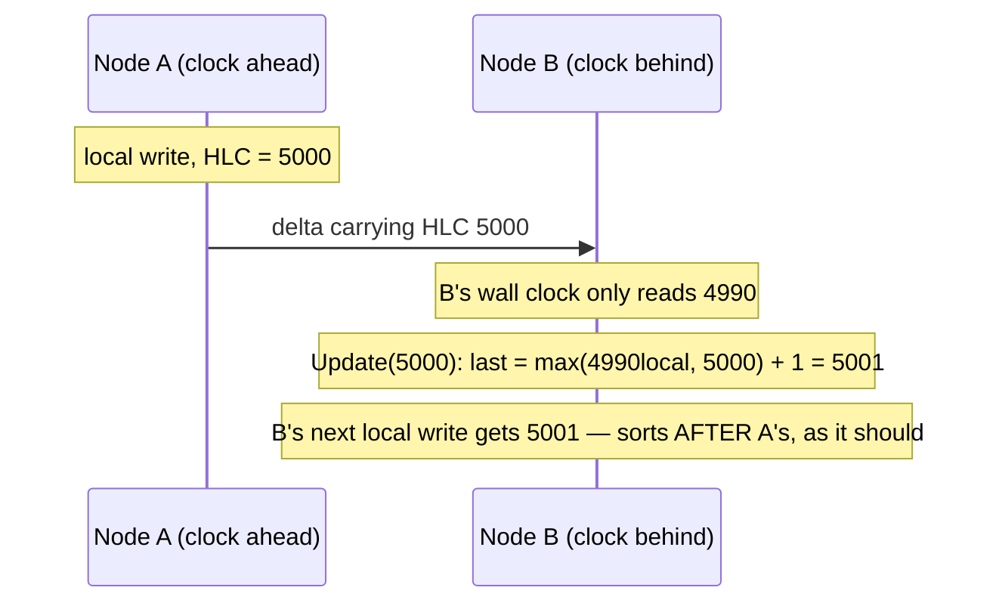

# 3. Time: Hybrid Logical Clocks

This chapter assumes [chapter 2](02-crdt-foundations.md): a register carries an
`HLC` field used to pick a last-writer-wins winner. This chapter explains what
that timestamp actually is and why convergeKV can't just use the system clock.

Code: `internal/hlc/hlc.go`.

## 3.1 Why wall-clock time fails

The obvious way to decide "which write is newer" is to stamp each write with the
machine's clock (`time.Now()`) and let the larger timestamp win. In a distributed
system this is quietly broken, for two reasons:

1. **Clocks disagree.** Two machines' clocks are never perfectly synchronised.
   Even with NTP they drift by milliseconds, and a misconfigured machine can be
   off by *seconds or minutes*. If Node A's clock is 3 seconds ahead, A's writes
   always "win" against B's — even writes A made genuinely earlier. Updates get
   silently lost based on clock skew, not on what actually happened.

2. **Clocks go backwards.** NTP corrections, leap seconds, and VM live-migration
   can make `time.Now()` *decrease*. Two writes on the *same* machine could then
   get the same timestamp, or even out-of-order timestamps, breaking the
   tie-breaking the system depends on.

What's needed is a clock that (a) never goes backwards, (b) stays *close* to real
time so "newer" roughly means newer, and (c) gives a strict total order even for
events in the same millisecond. That is a **Hybrid Logical Clock**.

## 3.2 What an HLC is

An HLC blends two ideas:

- A **physical** component: milliseconds since the Unix epoch, so the value tracks
  real time and is meaningful to humans ("this write was around 14:32").
- A **logical** component: a counter that increments when physical time hasn't
  moved, so events in the same millisecond still get distinct, ordered stamps.

convergeKV packs both into a single `uint64`:

```go
// internal/hlc/hlc.go
type Timestamp = uint64           // physical_ms << 16 | logical
const logicalBits = 16

func Pack(physMs uint64, logical uint16) Timestamp {
    return physMs<<logicalBits | uint64(logical)
}
```

The top 48 bits are physical milliseconds; the bottom 16 bits are a logical
counter. Putting physical in the high bits means **comparing two HLCs as plain
integers orders them physical-first, logical-second** — exactly the desired
behavior, and free (just `a > b`). 48 bits of milliseconds covers ~8900 years; 16
bits of logical counter allows 65,536 events inside a single millisecond before it
carries over.

## 3.3 The two rules: local events and received events

A `Clock` (`hlc.Clock`) is a small thread-safe struct holding the last timestamp
it issued. It updates by two rules.

**Rule 1 — local event (`Now`).** When a node does something locally (a write):

```go
// internal/hlc/hlc.go:43
func (c *Clock) Now() Timestamp {
    c.mu.Lock(); defer c.mu.Unlock()
    if pt := c.wallTS(); pt > c.last {
        c.last = pt        // wall clock moved forward: adopt it
    } else {
        c.last++           // wall clock stuck or went backward: bump logical
    }
    return c.last
}
```

If real time advanced since the last stamp, use real time (logical resets to 0
implicitly). If real time *didn't* advance — same millisecond, or the clock went
backwards — just increment the previous value by one. Because the increment lands
in the low bits, it bumps the logical counter; and if the logical counter
overflows its 16 bits, the `+1` naturally carries into the physical part, which
keeps ordering correct. The result is **strictly monotonic**: every `Now()` is
greater than the previous one, always.

**Rule 2 — received event (`Update`).** When a node receives a message carrying a
remote HLC (e.g. a replicated delta), it must ensure its own clock moves *past*
what it just learned about, so causally-later local events get larger stamps:

```go
// internal/hlc/hlc.go:57
func (c *Clock) Update(remote Timestamp) Timestamp {
    c.mu.Lock(); defer c.mu.Unlock()
    pt := c.wallTS()
    m := max(c.last, remote)   // at least as large as both clocks
    if pt > m {
        c.last = pt            // real time is ahead of both: just use it
    } else {
        c.last = m + 1         // otherwise step one past the max
    }
    return c.last
}
```

This is the standard "HLC receive rule." Its effect: a node that receives a delta
written "in the future" relative to its clock (because the sender's clock was
ahead) jumps its clock forward to just past it. Its subsequent writes then
correctly sort *after* that delta. The clock tracks the **causal frontier** of
everything seen, while staying as close to real wall-time as it can.

In convergeKV this rule fires in `Coordinator.MergeDelta`: it scans the delta's
registers for the largest HLC and folds it in (`coordinator.go:253`).



## 3.4 How the HLC is used in convergeKV

The HLC has exactly **one** semantic job: arbitrating last-writer-wins for two
*concurrent* writes to the same field. Recall `supersedes` from chapter 2 — its
first comparison is `r.HLC > o.HLC`. Higher HLC wins; ties fall through to actor
bytes then sequence number.

That is it. The HLC does **not** determine causality (the causal context does
that — chapter 2) and does **not** gate which writes are accepted. It is purely the
"which of these genuinely-simultaneous edits should the user see" tiebreaker. This
is why a pure-removal delta, which carries no register and therefore no HLC, simply
does not advance the receiver's clock — there is no value to arbitrate, so it does
not matter (a deliberate, harmless narrowing).

## 3.5 Surviving restarts

A clock is in memory. If a node crashes and restarts, its `last` is gone — and a
naive restart from `time.Now()` could, after a backwards wall-clock correction,
*reissue a timestamp already used*, breaking monotonicity across the crash.

convergeKV guards this with periodic **checkpointing** plus a **safety bump**:

- Every `min(1s, grace/4)` the node persists the current clock value to disk
  (`Store.PersistHLC`, called from `node.checkpointHLC`).
- On restart it loads the checkpoint and sets the clock to `checkpoint +
  hlcRestartBump`, where the bump is 10 seconds of physical time
  (`node.go:36`, `clock.SetAtLeast`).

The bump covers the window between the last checkpoint and the crash: even if the
node issued thousands of stamps in that gap, 10 seconds of millisecond-resolution
headroom (plus the logical counter) is far more than enough to stay strictly above
anything used before. `SetAtLeast` only ever raises the clock, never lowers it, so
it composes safely with whatever the wall clock reads.

## 3.6 Summary

- Wall-clock timestamps can't order distributed events: clocks skew and run
  backwards.
- An **HLC** packs 48-bit physical ms and a 16-bit logical counter into a `uint64`;
  integer comparison orders them correctly.
- `Now()` keeps the clock strictly monotonic for local events; `Update(remote)`
  advances it past anything received, tracking the causal frontier.
- The HLC's sole job is **last-writer-wins arbitration** for concurrent same-field
  writes; causality is handled separately by causal contexts.
- Checkpoint + a 10s restart bump keep the clock monotonic across crashes.

Next: [partitioning & placement](04-partitioning-placement.md) — how keys are
spread across nodes and how every node agrees on who owns what.
