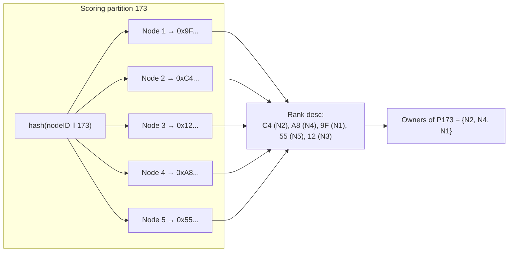

# 4. Partitioning & Placement

How does the cluster decide *which nodes* store *which keys* — and do it so that
every node reaches the same answer without anyone coordinating? Two layers:
**partitioning** (key → partition) and **placement** (partition → owner nodes).

Code: `internal/placement/placement.go`.

## 4.1 Partitioning: keys into a fixed number of buckets

Tracking each key's location individually would not scale — with billions of keys
that mapping would itself be huge. Instead every key is hashed into one of a
*fixed* number of **partitions** (also called shards). The partition is a small
integer.

```go
// internal/placement/placement.go:20
func Partition(key []byte, p uint16) uint16 {
    return uint16(xxhash.Sum64(key) % p)
}
```

`xxhash` is a fast, non-cryptographic hash. The key is hashed to a 64-bit number
and reduced mod `P`, the partition count. `P` defaults to **256** and is a power
of two, fixed at cluster birth (config `Partitions`, validated in
`internal/config/config.go:89`). A good hash spreads keys evenly, so each
partition holds roughly `1/P` of the data.

### Why fixed, and why a separate partition layer?

Why not hash keys *directly* to nodes? Because then **adding or removing a node
would remap almost every key** (the mod changes), forcing a near-total data
reshuffle. The partition layer is **indirection that limits churn**: keys map to
partitions (which never change), and only the much smaller partition→node mapping
shifts when membership changes. Adding one node to a 10-node cluster should move
about `1/10` of the data, not all of it. The fixed partition count is the stable
backbone the whole placement scheme balances on.

A node joining with a *different* `P` than the cluster is **rejected** and shuts
down — a `P` mismatch would make two nodes disagree about where every key lives,
which is unrecoverable. This rejection happens in the gossip layer (chapter 5).

## 4.2 Placement: partitions to owners with rendezvous hashing

Now: given partition #173, which 3 nodes own it? The answer must be:

- **Deterministic** — every node computes the same owners from the same membership.
- **Balanced** — partitions spread evenly across nodes.
- **Low-churn** — adding/removing a node disturbs as few partition→owner mappings
  as possible.

The technique is **HRW — Highest Random Weight**, also called **rendezvous
hashing**. The idea is delightfully simple. For a given partition, score every
node by hashing `(nodeID, partitionID)` together, then **rank nodes by that score**
and take the top RF=3 as owners:

```go
// internal/placement/placement.go — inside Compute
copy(buf, m.Meta.ID[:])
binary.BigEndian.PutUint16(buf[16:], pid)
rank[i] = ranked{hash: xxhash.Sum64(buf), member: m}   // score = hash(nodeID ‖ pid)
// ...sort descending by hash; top RF are owners...
```

Why does this give all three properties?

- **Deterministic:** the score is a pure hash of public data (`nodeID`,
  `partitionID`). No randomness, no shared state. Two nodes with the same member
  list compute identical rankings. (Hash ties are broken by node ID so the order is
  *totally* deterministic — `placement.go:72`.)
- **Balanced:** because the hash mixes the node ID into each partition's score
  independently, each node ends up ranked #1 for roughly `P/N` partitions. Owners
  spread evenly.
- **Low-churn — the key advantage:** when a node is removed, only the partitions it
  *owned* need a new owner, and each such partition simply promotes its
  *next-highest-ranked* node. Crucially, **the relative ranking of the surviving
  nodes is unchanged** — removing one node can't reshuffle how the others compare,
  because each node's score is computed independently. So no unrelated partition
  moves. Adding a node is the mirror image: it becomes an owner only for the
  partitions where its score happens to crack the top 3, displacing exactly one old
  owner each. This "only the necessary minimum moves" property is what makes HRW a
  great fit for elastic clusters.



Every node runs this same computation on its own copy of the membership list and
arrives at the same owners — **agreement without communication**. Identical
membership views always yield identical owner tables.

## 4.3 The owners table: the `View`

`placement.Compute` builds a `View`: an immutable snapshot mapping every partition
to its ranked owners, derived from one membership snapshot.

```go
// internal/placement/placement.go:36
type View struct {
    p      uint16
    owners [][]Owner   // owners[pid] = ranked owners of partition pid
}
type Owner struct {
    ID     [16]byte
    Addr   string         // the gRPC address peers dial
    Status cluster.Status // bootstrapping / active / draining / none
    Dead   bool           // within post-crash grace: holds its slot, serves nothing
}
```

The `View` is recomputed whenever membership changes and stored atomically in the
node (`node.view atomic.Pointer[View]`), so readers always see a consistent
snapshot. Because it is a pure function of membership, it needs no locking beyond
the pointer swap.

## 4.4 Status flags: a node isn't simply "an owner"

Being ranked in the top 3 isn't the whole story. A node that *just* gained a
partition doesn't have its data yet — it must not serve reads from an empty store.
So each owner advertises a per-partition **status** (chapter 5 explains how it is
gossiped):

- **`bootstrapping`** — an owner that is receiving writes and deltas but doesn't
  have all the data yet, so it **must not serve reads** and **must not be picked as
  applier**.
- **`active`** — fully serving: reads, writes, applier duty.
- **`draining`** — a planned leaver; still serves until its successor is ready.
- **`none`** — not an owner of this partition.

The `View` exposes three derived sets that the request paths (chapter 7) consult,
each filtering owners by status (`placement.go:112`):

| Set | Includes | Used for |
|-----|----------|----------|
| **`WriteSet(pid)`** | active + bootstrapping + draining | who must receive writes & replicated deltas |
| **`ReadSet(pid)`** | active + draining | who may serve reads |
| **`Applier(pid)`** | first active-or-draining owner in rank order | who mints dots & persists a write |

Bootstrapping owners are in the write set (they need the data flowing in) but *not*
the read set or applier choice (their data is incomplete). This separation is what
makes adding a node seamless: it starts catching up *before* it is trusted to
serve.

## 4.5 Dead-but-not-gone: holding a slot through the grace period

When a node crashes, there is a dilemma. Instantly promoting a successor means a
node that merely rebooted (back in 5 seconds) would trigger a pointless, expensive
data transfer to its replacement — a "transfer storm" under any flapping. But
never promoting means a truly-dead node permanently weakens the partition.

The compromise: a crashed node becomes a **dead phantom**. For a **grace period**
(default 10 minutes) it *keeps its placement slot* — it still ranks, still counts
as an owner — but it serves nothing and is skipped by every set above (`Dead:
true`, filtered out everywhere). During grace, the partition runs on its 2
surviving owners; no transfer happens. If the node comes back within grace, it
reclaims its slot and catches up cheaply via anti-entropy. Only when the grace
period expires is the phantom dropped and a fresh successor promoted to restore
RF=3. This logic lives in `Compute` (the `dead` slice and the `held` accounting,
`placement.go:46`) and in the cluster layer's dead-node table (chapter 5).

### Extending past RF for a draining leaver

There is a subtlety in `Compute`: normally it stops at RF owners, but when an owner
is **draining** (planned leave), the list extends to up to `2*RF` so the *next*
node in rank starts bootstrapping *while the leaver still serves*. This makes a
planned departure seamless — the successor is `active` before the leaver actually
goes (`placement.go:80`, the `held` counter only counts non-leaving owners). A dead
phantom never gets this extension (a successor is never bootstrapped *into* a slot a
phantom still holds — that is the no-transfer-storm guarantee); only live
successors step up for a draining leaver.

## 4.6 Summary

- **Partitioning:** `partition(key) = xxhash(key) % P`, with `P` fixed at cluster
  birth. The fixed partition layer is indirection that limits data movement when
  membership changes.
- **Placement:** **HRW/rendezvous hashing** scores each node per partition by
  `hash(nodeID ‖ pid)` and takes the top RF=3. It is deterministic (no
  coordination), balanced, and moves the minimum data on membership change.
- The **`View`** is an immutable owners table recomputed on every membership
  change; identical inputs yield identical tables on every node.
- Owners carry a per-partition **status** (`bootstrapping`/`active`/`draining`);
  derived **WriteSet / ReadSet / Applier** sets drive the request paths.
- A crashed owner becomes a **dead phantom** that holds its slot through a grace
  period to avoid needless transfers; draining leavers let successors bootstrap
  ahead of time.

Next: [membership & gossip](05-membership-gossip.md) — where the membership list
the `View` is built from actually comes from.
