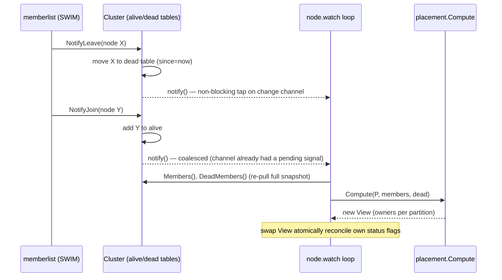

# 5. Membership & Gossip

Placement (chapter 4) needs a **membership list**: who is in the cluster right now,
at what address, with what status. This chapter is about how that list is built and
kept fresh — without any central registry — using **gossip**.

Code: `internal/cluster/` (`cluster.go`, `meta.go`, `delegates.go`), built on
`hashicorp/memberlist`.

## 5.1 The problem: who is alive?

In a cluster with no leader, every node needs an up-to-date answer to "which nodes
exist, and which are reachable?" One option is to put a central server in charge —
but that server becomes a single point of failure and a bottleneck, exactly what a
leaderless design avoids. Instead convergeKV uses a **decentralised, epidemic**
approach: nodes tell each other, a little at a time, and information spreads like a
rumour through a crowd. That is **gossip**.

## 5.2 SWIM in one page

convergeKV uses the **SWIM** protocol (Scalable Weakly-consistent
Infection-style Membership) via the `hashicorp/memberlist` library. SWIM has two
jobs:

**1. Failure detection (is node X alive?).** Periodically, each node picks a random
peer and sends it a **ping**. If the peer replies, it is alive. If it doesn't reply
in time, the pinger doesn't immediately declare it dead — that would make a single
dropped packet look like a failure. Instead it asks `k` *other* random nodes to
ping X on its behalf (**indirect probes**). Only if X answers *none* of them is X
declared **suspect**, and after a timeout, **dead**. This indirection makes the
detector robust to isolated network blips.

**2. Dissemination (spreading the news).** When a node learns something — X joined,
X is suspected, X updated its metadata — it piggybacks that news onto its regular
ping/ack traffic. Each recipient passes it on. Like an infection, the update
reaches the whole cluster in `O(log N)` rounds. There is no broadcast storm and no
central coordinator; just steady, bounded chatter.

"Weakly-consistent" in the name is honest: at any instant, two nodes may have
*slightly* different views (one already knows X died, another hasn't heard yet).
The views **converge** quickly. convergeKV is built to tolerate that lag —
placement is recomputed locally whenever the view changes, and the CRDT layer
tolerates the brief disagreement.

## 5.3 What rides along: node metadata

Beyond liveness, every node attaches a small **metadata payload** to its gossip
presence. This is how nodes learn each other's address, partition count, and
per-partition status:

```go
// internal/cluster/meta.go:64
type NodeMeta struct {
    ID         [16]byte        // node UUID = ActorID
    Partitions uint16          // the cluster-wide P this node booted with
    Generation uint64          // node start time (ms); orders restarts of one node
    RPCAddr    string          // the node-service gRPC address peers must dial
    Flags      PartitionFlags  // packed per-partition Status, 2 bits each
}
```

A few things worth noting:

- **`RPCAddr`** is how peers find each other's data-plane gRPC server. Identity
  (`ID`) is *never* derived from network address — a node keeps its UUID across
  restarts and IP changes (chapter 11). Address and identity are decoupled.
- **`Generation`** is the node's start timestamp. If a node crashes and restarts,
  its new generation is higher, which lets peers tell "this is a fresh incarnation"
  apart from "the old one."
- **`Flags`** packs one `Status` (none/bootstrapping/active/draining — 2 bits) per
  partition, 4 per byte (`PartitionFlags`, `meta.go:38`). This is the
  per-partition status that placement's WriteSet/ReadSet read.

### The 512-byte budget and why P ≤ 1024

memberlist caps each node's gossiped metadata at **512 bytes** — it has to fit in
network packets that fly around constantly. The encoding is `28 + len(RPCAddr) +
P/4` bytes (`meta.go:74`). With 2 bits per partition, `P = 1024` needs 256 bytes of
flags, leaving room for the address. That is why config rejects `P > 1024`
(`config.go:92`) — a direct, physical consequence of the gossip packet budget. The
`P ≤ 1024` ceiling is a deliberate tightening of the "power of two" requirement.

## 5.4 Rejecting a mismatched partition count

A node that booted with a different `P` is poison: it would disagree with everyone
about where keys live. memberlist allows vetoing such a node *before* it enters the
view, via two delegate hooks (`internal/cluster/delegates.go`):

```go
// NotifyAlive — called before accepting gossip ABOUT a peer
func (a *aliveDelegate) NotifyAlive(peer *memberlist.Node) error {
    meta, err := DecodeMeta(peer.Meta)
    if err != nil { return err }                       // reject undecodable
    if meta.Partitions != c.nodeP {
        return fmt.Errorf("...partition count %d != ours %d", meta.Partitions, c.nodeP)
    }
    return nil                                          // nil = accept
}
```

Returning an error keeps the mismatched node out of the alive set. The same check
runs in `NotifyMerge` (join-time state exchange), which makes a misconfigured
joiner's `Join` call **fail loudly** so it shuts down instead of corrupting the
cluster (`cluster.go:131` surfaces that error). This is the enforcement point for
"fixed P, mismatch is fatal" from chapter 4.

## 5.5 The cluster's own view: alive and dead tables

The library calls back into convergeKV on every membership event (join, leave,
update). The `Cluster` struct maintains two maps from these callbacks
(`internal/cluster/cluster.go:53`):

```go
alive  map[[16]byte]Member       // currently-reachable members (incl. self)
dead   map[[16]byte]deadEntry    // recently-dead, still within grace; with timestamp
```

The event handlers (`delegates.go`):

- **`NotifyJoin`** — decode the new member's meta, add to `alive`, remove from
  `dead` (a returning node).
- **`NotifyLeave`** — the node left or died. A **graceful** leave
  (`StateLeft`) releases the placement slot immediately. An **unannounced** death
  moves the member to `dead` *with the current time*, where it waits out the grace
  period (the dead-phantom mechanism from chapter 4). If the metadata can't be
  decoded, the node is still evicted by parsing its ID from the memberlist name
  (which is the hex node ID) — a corrupt-meta peer must never get stuck in the view
  forever (`delegates.go:71`).
- **`NotifyUpdate`** — a member changed its metadata (e.g. flipped a partition to
  `active`); refresh its entry.

A background `pruneDead` ticker (`cluster.go:142`) drops dead entries whose grace
period has elapsed, which is what finally frees a partition slot for successor
promotion.

> **Why keep a separate dead table instead of trusting memberlist?** Because the
> *grace period* is convergeKV's policy, not memberlist's. memberlist reports "X is
> gone"; convergeKV decides "but hold X's ownership slot for 10 more minutes in case
> it reboots." The `dead` table with its `since` timestamps implements that policy.

## 5.6 How consumers get the view: a coalescing signal

There is an elegant piece of design here. Placement must recompute whenever
membership changes — but membership can change in bursts (a node restart fires
leave *then* join in quick succession). Delivering every micro-event risks a slow
consumer falling behind or missing one.

Instead, `Cluster` exposes a **coalescing change signal**: a buffered channel of
capacity 1. Any change does a non-blocking send into it:

```go
// internal/cluster/cluster.go:268
func (c *Cluster) notify() {
    select {
    case c.change <- struct{}{}:
    default: // a signal is already pending; consumers re-pull anyway
    }
}
```

The consumer (the node's `watch` loop, chapter 11) waits on this channel and, when
woken, **re-pulls a fresh consistent snapshot** with `Members()` and
`DeadMembers()`. The signal carries *no data* — it is just a "something changed, go
look" prompt. Consequences:

- A slow consumer can never *lose* a membership change; at worst it processes
  several at once (the channel coalesces them into one wake-up).
- There is no per-event ordering to get wrong — the consumer always reads the
  latest complete state, never a half-applied stream of deltas.

This "signal + re-pull snapshot" pattern (instead of "stream of events") is a
recurring, deliberate choice in convergeKV: it trades a little freshness for a lot
of robustness.



## 5.7 Updating local flags

When a node's ownership or status changes, it must tell the cluster. `UpdateFlags`
mutates the local flags, updates the node's own view immediately, fires the change
signal, and pushes the new metadata into gossip (`cluster.go:223`). The push is
serialized with a mutex because memberlist's `UpdateNode` isn't safe to call
concurrently. The new flags then spread epidemically and other nodes'
`NotifyUpdate` handlers pick them up.

## 5.8 Summary

- Membership uses **gossip (SWIM)** via `hashicorp/memberlist`: random pinging with
  indirect probes for robust failure detection, and epidemic dissemination for
  spreading news in `O(log N)` rounds — no central registry.
- Each node gossips a small **`NodeMeta`**: UUID, partition count, generation, gRPC
  address, and packed per-partition status flags. The 512-byte gossip budget caps
  `P` at 1024.
- A **partition-count mismatch is vetoed** at `NotifyAlive`/`NotifyMerge`, keeping
  poisonous nodes out and failing a misconfigured joiner loudly.
- The cluster keeps **alive** and **dead** tables; the dead table enforces
  convergeKV's grace-period policy for the dead-phantom mechanism.
- Consumers learn of changes through a **coalescing signal + snapshot re-pull**,
  which can't lose updates and needs no per-event ordering.

Next: [the storage engine](06-storage.md) — how a node durably stores all this on
local disk.
