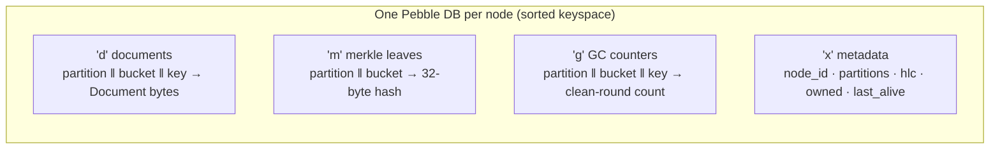

# 6. The Storage Engine

Each node must store its documents on local disk so they survive restarts. This
chapter covers the storage layer: the engine (Pebble), the on-disk key layout, why
documents and their Merkle leaves are written together atomically, and the various
bookkeeping keys.

Code: `internal/storage/store.go`.

## 6.1 Pebble: an embedded LSM key-value store

convergeKV stores data in **Pebble**, an embedded key-value engine (the same one
inside CockroachDB; an LSM-tree design in the RocksDB family). "Embedded" means it
is a library linked into the process, not a separate server — each node owns its
own private Pebble database on local disk.

Pebble's internals aren't important here, only its contract:

- It is an **ordered key-value map**: keys and values are byte strings, and keys
  can be iterated in **sorted byte order**. That ordering is the foundation of the
  key layout below — careful key design turns "all documents in partition 5" into a
  contiguous, efficiently-scannable range.
- It supports **atomic batches**: a group of writes that commit all-or-nothing.
- It supports **synced writes**: `pebble.Sync` forces data to durable storage
  (fsync) before returning, so a power loss right after can't lose it. (LSM stands
  for *Log-Structured Merge-tree*; the "log" is a write-ahead log that makes this
  durable and fast.)
- It supports **consistent snapshots**: a frozen read-only view for iterating a
  range while writes continue.

`Store` (`store.go:44`) is a thin wrapper giving convergeKV-shaped methods over
Pebble's generic API.

## 6.2 The key layout: one database, prefix-separated

All of a node's state lives in **one** Pebble database. Different *kinds* of data
are separated by a one-byte **prefix** at the start of each key, and within a kind,
keys are structured so that related data sorts together (`store.go:8`):

```
'd' ‖ partitionID(uint16 BE) ‖ bucket(uint16 BE) ‖ userKey   ->  canonical Document
'm' ‖ partitionID(uint16 BE) ‖ bucket(uint16 BE)             ->  merkle leaf hash
'g' ‖ partitionID(uint16 BE) ‖ bucket(uint16 BE) ‖ userKey   ->  GC clean-round counter
'x' ‖ name                                                   ->  node metadata
```

`BE` = big-endian, which matters: big-endian integers sort in the same order as the
numbers themselves, so partition 5 sorts before partition 6, and within a partition,
bucket 0 before bucket 1. That is what makes range scans work.

Reading the layout:

- **`'d'` documents** — the actual data. The key is `partition`, then `bucket`, then
  the user's key. The **bucket** is the Merkle bucket (chapter 8):
  `merkle.Bucket(key) = xxhash(key) % 1024`. Embedding the bucket *in the key* is a
  deliberate design choice — it makes "all documents in bucket 173 of partition 5" a
  single contiguous range, so anti-entropy can scan one bucket with a bounded range
  scan (`ScanBucket`, `store.go:141`) instead of scanning the whole partition and
  filtering. This is why repair I/O is O(bucket), not O(partition).
- **`'m'` merkle leaves** — one 32-byte hash per `(partition, bucket)`. The
  anti-entropy tree (chapter 8).
- **`'g'` GC counters** — a small counter per residual document tracking how many
  consecutive clean anti-entropy rounds have covered it (chapter 10). Mirrors the
  `'d'` layout so GC scans align with document scans.
- **`'x'` metadata** — a handful of singleton keys: `node_id`, `partitions`, `hlc`
  (clock checkpoint), `owned` (ownership bitmap), `last_alive` (liveness lease).
  Covered as they come up in chapters 3 and 11.



## 6.3 The atomic doc-plus-leaf batch

This is the most important durability rule in the storage layer, and it ties
directly into anti-entropy.

Every partition maintains a **Merkle tree** (chapter 8) summarising its contents,
so that owners can compare their data cheaply. Each document contributes a hash to
its bucket's leaf. The critical invariant: **a document and its bucket's leaf must
always agree.** If they ever disagree — say the document is updated but the leaf
isn't — anti-entropy would either miss a real difference or chase a phantom one
forever.

A crash must never be able to break that agreement. So convergeKV writes the
document and its updated leaf in **one atomic, synced batch**:

```go
// internal/coordinator/coordinator.go:398 — persist()
leaf, _ := c.store.MerkleLeaf(pid, bucket)
if oldHash != nil { merkle.XOR(&leaf, *oldHash) }      // remove old doc's contribution
merkle.XOR(&leaf, merkle.DocHash(keyB, doc.Canonical())) // add new doc's contribution

b := c.store.NewBatch()
b.SetDocument(pid, keyB, doc)                  // the document
b.SetMerkleNode(pid, merkle.BucketPath(bucket), leaf[:]) // its leaf, updated
return c.store.Commit(b)                        // atomic + fsync
```

The leaf is maintained **incrementally** via XOR: a bucket's leaf is the XOR of all
its documents' hashes. To update one document, XOR out its old hash and XOR in its
new one — O(1), no need to re-read the bucket. XOR is perfect here because it is its
own inverse (`a ^ x ^ x = a`) and order-independent. Because both writes are in one
`Commit(pebble.Sync)`, a power loss either commits both or neither — the document
and leaf can never tear apart. (chapter 8 explains how a rare drift is still
self-healed.)

## 6.4 Reading and scanning

- **`GetDocument(pid, key)`** (`store.go:105`) — point lookup; decodes the canonical
  bytes back into a `crdt.Document`, returning `nil` for "not present."
- **`ScanPartition(pid, fn)`** (`store.go:123`) — iterate every document of a
  partition in key order, over a **consistent snapshot** so the scan sees a frozen
  view even as writes continue. Used by GC and full snapshot transfer.
- **`ScanBucket(pid, bucket, fn)`** (`store.go:141`) — iterate just one Merkle
  bucket, a bounded range thanks to the bucket-in-key layout. Used by anti-entropy
  repair and leaf recomputation.

Decoding validates strictly: a corrupt document is a hard error
(`"corrupt document ... "`), never silently skipped.

## 6.5 Partition-level operations

Because ownership shifts as the cluster changes, the store has whole-partition
operations:

- **`DropPartition(pid)`** (`store.go:259`) — delete a partition's `d`/`m`/`g` ranges
  in one synced batch. Used when a node **loses ownership**: its now-stale copy must
  go, because keeping it risks resurrecting documents the new owners have since
  deleted (chapter 10). Each range is a single `DeleteRange` — contiguous by
  construction.
- **`HasPartitionData(pid)`** (`store.go:271`) — cheap "is there anything here?"
  probe, used to decide whether a regained partition needs a fresh bootstrap.
- **`WipeData()`** (`store.go:234`) — nuke *all* documents, leaves, GC counters, and
  the ownership bitmap, but keep identity, partition count, and the HLC checkpoint.
  Used on lease-expiry recovery (chapter 11). Crucially, a wipe **must** be paired
  with identity rotation, because the wiped contexts were the only local record of
  what this actor had minted — the comment at `store.go:230` spells out why.

## 6.6 Metadata and binding

The `'x'` keys hold singletons, with two protective "bind" operations:

- **`BindNodeID(id)`** (`store.go:425`) — on first use, pins this data directory to a
  node UUID; afterwards it *rejects* any other identity. This prevents accidentally
  pointing a node at another node's data directory, which would let it forge that
  actor's dots — a correctness disaster.
- **`BindPartitionCount(p)`** (`store.go:436`) — same idea for `P`: the data dir
  remembers the partition count it was created with.

`RebindNodeID` (`store.go:431`) is the one sanctioned way to overwrite the pinned
identity, and only as part of the wipe-and-rotate recovery (chapter 11) — the fresh
actor has minted nothing, so there is nothing to forge.

Other `'x'` keys: `PersistHLC` (clock checkpoint, chapter 3), `PersistOwned`/`Owned`
(ownership bitmap for fast restart-within-grace, chapter 11), and
`PersistLastAlive`/`LastAlive` (the liveness lease, chapter 11).

## 6.7 Summary

- Each node owns a private **Pebble** LSM database; convergeKV uses its ordered
  keyspace, atomic batches, synced (fsync) writes, and consistent snapshots.
- One database holds everything, separated by a one-byte **prefix**
  (`d`/`m`/`g`/`x`) and structured so related data sorts contiguously. Embedding the
  **Merkle bucket in the document key** makes per-bucket scans O(bucket).
- A document and its **Merkle leaf are written in one atomic synced batch**, so a
  crash can never desynchronise data from its anti-entropy summary. Leaves are
  maintained incrementally by **XOR**.
- Whole-partition ops (`DropPartition`, `WipeData`) support ownership changes and
  crash recovery; **bind** operations pin a data directory to one identity and `P`.

Next: [the request paths](07-request-paths.md) — the information flow for writes,
reads, and replication, where storage, placement, and the CRDT all come together.
