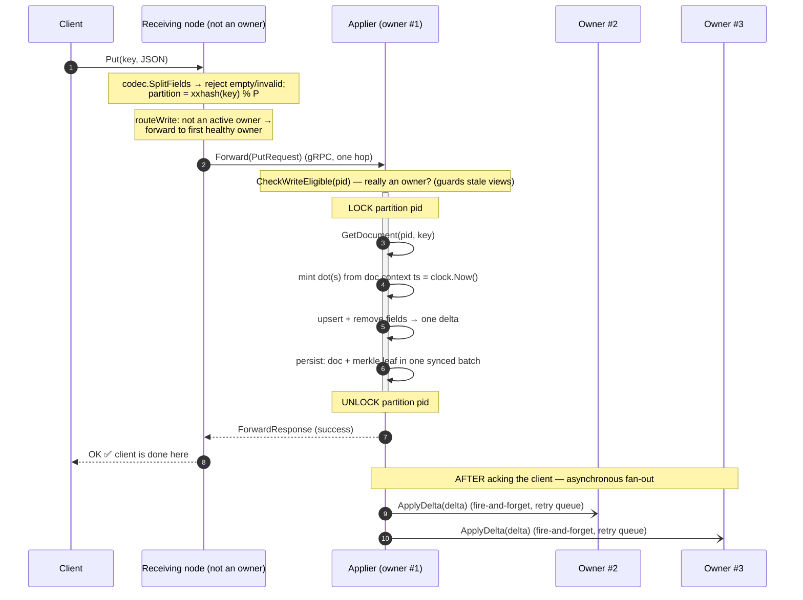
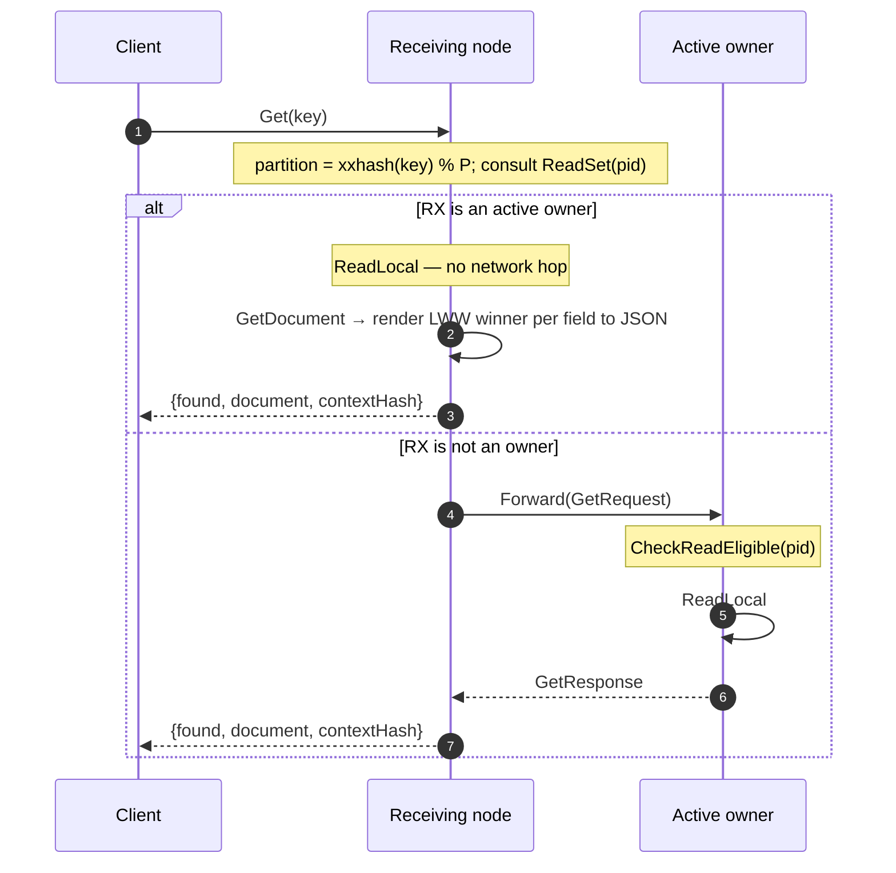
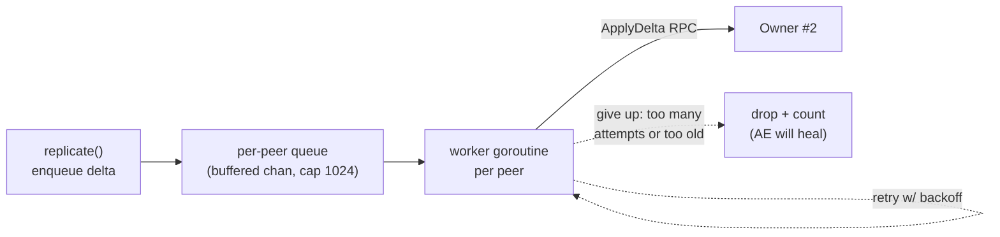

# 7. The Request Paths (Information Flow)

This chapter traces what actually happens, end to end, for the three client
operations — **write**, **read**, **delete** — and for the **asynchronous
replication** that follows a write. It is where the CRDT (ch. 2), clocks (ch. 3),
placement (ch. 4), and storage (ch. 6) finally meet.

Code: `internal/coordinator/coordinator.go`, `internal/replication/fanout.go`,
`internal/api/` (gRPC servers and the connection pool).

## 7.1 The cast

- **Client** — any program speaking the gRPC `KV` service
  (`Get`/`Put`/`Patch`/`Delete`).
- **Receiving node** — whichever node the client happened to connect to. May or may
  not be an owner of the key's partition.
- **Applier** — the one owner that mints the dot and persists the write. The first
  `active`-or-`draining` owner in HRW rank order (`View.Applier`).
- **Other owners** — the remaining members of the partition's write set; they
  receive the change asynchronously.

The same code (`internal/coordinator`) runs on every node — there is no special
"coordinator node." Any node coordinates whatever request lands on it.

## 7.2 The guiding principles

Two decisions shape everything here:

1. **No quorums.** A write is acknowledged as soon as **one** node — the applier —
   has applied and durably persisted it. The system does *not* wait for the other
   owners. This makes writes fast (one fsync, no peer round-trip) at the cost of a
   brief window where the other owners are behind.
2. **One extra hop, at most.** If the receiving node isn't an eligible owner, it
   forwards the *whole request* to one owner (the applier). That is a single extra
   network hop — not a scatter-gather, not a broadcast.

## 7.3 The write path (Put / Patch)

Trace `Put("user:42", {"name":"Alice"})` from a client connected to a
**non-owner** node.



Step by step, with code:

**1–2. Receiving node: parse and locate.** `Coordinator.Put` (`coordinator.go:86`)
splits the JSON into top-level fields (`codec.SplitFields`) and rejects anything
that isn't a non-empty JSON object — an empty `{}` is refused *before* minting
anything, because an empty document would diverge from peers and make anti-entropy
churn (the comment at `coordinator.go:91` explains). Then `placement.Partition`
computes the partition.

**3. Route to the applier.** `routeWrite` (`coordinator.go:147`) walks the
partition's owners in rank order, skipping dead or not-fully-serving ones. For the
first eligible owner: if it is *this* node, execute locally (no hop); otherwise
`Forward` the whole request over gRPC. If a forward fails, it tries the
next-ranked owner. If none is reachable, it returns `ErrNoOwnerAvailable` →
`UNAVAILABLE` (the client should retry).

**4. Applier eligibility re-check.** On the receiving end, `NodeServer.Forward`
(`api/server.go:57`) calls `CheckWriteEligible` before doing anything. Why
re-check? Because the sender's `View` might be stale — it might forward to a node
that *just* stopped being an owner. The applier re-validates against its *own*
view and returns `FAILED_PRECONDITION` if it is not eligible, so the sender retries
elsewhere. This double-check is how the system stays correct despite
eventually-consistent membership.

**5–9. Apply under the partition lock.** `Put`, `Patch`, and `Delete` share one
core, `applyWrite` (`coordinator.go`) — *upsert a set of fields and remove a set
of fields, as one delta*:

```go
c.locks[pid].Lock()          // serialize all writes to this partition
defer c.locks[pid].Unlock()

doc, _ := c.store.GetDocument(pid, key)   // current state (nil if new)
oldHash := docHashOf(key, doc)            // for the incremental leaf update
if doc == nil { doc = crdt.NewDocument() }

// Put: the remove set is every observed field the request OMITS.
// Patch: the remove set is the explicit delete_fields.
mint := doc.Minter(crdt.ActorID(c.self))           // dots from the doc's own context
delta := doc.PutMulti(upserts, mint, c.clock.Now()) // set fields → delta
for _, f := range removes {                         // RemoveField → merged into delta
    if doc has f { delta.Merge(doc.RemoveField(f, mint())) }
}
c.persist(pid, key, oldHash, doc)         // atomic doc+leaf batch (ch. 6)
c.replicate(pid, key, delta)              // enqueue async fan-out
```

The **per-partition lock** (`locks []sync.Mutex`, one per partition) serializes
read-modify-write for a partition, so two concurrent writes to keys in the same
partition can't interleave and corrupt state. There is **no global lock** — writes
to *different* partitions run fully in parallel. This is the "shard-per-partition"
concurrency model. Dots are minted from the document's own context
(`Document.Minter`, chapter 2 §2.5), `clock.Now()` provides the HLC, and each op
mutates the document while emitting the delta to ship.

### Put replaces, Patch updates

The only difference between the two writes is **how the remove set is chosen**:

- **`Put` is replace.** It sets the fields in `value` and removes every field the
  document currently holds that `value` omits — the remove set is computed from
  the loaded document under the lock.
- **`Patch` is a partial update.** It sets `value`'s fields and removes only the
  names in `delete_fields`; everything else is left alone. (A `Patch` with no
  deletes is a pure field-level upsert — this is the op that lets two clients set
  *different* fields on one key and both survive.)

Both removals are **add-wins**: `RemoveField` (chapter 2 §2.5) only covers the
dots the applier has *already observed*, so a field added concurrently on another
owner that this applier hasn't seen yet **survives** the merge. `Put` is therefore
not a hard "the document is now exactly this" guarantee under concurrency — it
removes what it saw, not what it didn't. Removing a field the applier doesn't hold
is skipped entirely, so a delete never plants pointless tombstone context.

**10. Acknowledge the client.** The applier returns success. **The client is now
done** — its write is durable on one node. Everything below happens after the
client has moved on.

**11–12. Asynchronous fan-out.** `replicate` (`coordinator.go:425`) enqueues the
delta for every *other* write-set owner. This is fire-and-forget — covered in §7.6.

### What if the receiving node *is* an owner?

Then `routeWrite` finds itself first in rank order and calls `local()` directly —
no network hop at all. In a well-balanced cluster, a client connected to any node
has a good chance of hitting an owner, so most writes are single-hop.

## 7.4 The read path (Get)

Reads are simpler: serve from **one** active owner, locally if possible.



`Coordinator.Get` (`coordinator.go:121`) checks the **ReadSet** (active + draining
owners — *not* bootstrapping ones, whose data is incomplete). If this node is in
it, `ReadLocal` reads from disk and renders. Otherwise it forwards to each
read-set owner in turn until one answers, falling back across owners on failure.

`ReadLocal` (`coordinator.go:228`) loads the document and, if it has fields, calls
`codec.RenderDocument` — which asks `doc.Get(field)` for the **LWW winner** of
each field (chapter 2 §2.4) and emits JSON with deterministically ordered keys. An
empty-fields document (a deleted residual) reads as **not found**. It also returns
a `contextHash` for diagnostics.

**Crucially, there is no read repair.** A read does *not* contact other owners to
reconcile — it returns whatever the one chosen owner has. If owners have briefly
diverged, two reads might momentarily see different values. This is the
availability/consistency trade-off in action: reads are fast and single-owner, and
**anti-entropy (chapter 8) is the only thing that reconciles divergence.** That is
a deliberate, load-bearing decision, which is why anti-entropy must run
aggressively.

## 7.5 The delete path

`Delete` (`coordinator.go:108`) routes exactly like `Put` — to the applier, under
the partition lock — but calls `doc.Delete` (chapter 2 §2.5), which clears all
fields while keeping a **residual context** covering every removed dot. The result
persists as "empty fields, non-empty context": a tombstone that reads as
*not found* but cannot be undone by a late write. The delta carries the removed
dots and fans out like any write. *When* that residual is finally discarded is the
subject of [chapter 10](10-garbage-collection.md).

## 7.6 Asynchronous replication: the fan-out

After the applier acks the client, it must still get the delta to the other two
owners. This is the **fan-out**, and it is deliberately *unreliable-but-bounded*:
fire-and-forget through an in-memory retry queue, with no acknowledgements and no
persistence. Anything it drops is the anti-entropy backstop's problem.

Code: `internal/replication/fanout.go`.



The design (`fanout.go`):

- **One bounded queue + one worker goroutine per peer** (`Enqueue`, `fanout.go:89`).
  The queue is a buffered channel of capacity 1024.
- **Enqueue never blocks.** If a peer's queue is full, the delta is **dropped and
  counted** (`deltas_dropped_total`), not buffered unboundedly. A slow or dead peer
  can never apply back-pressure to the fast write path. This is **load shedding**:
  under overload replication work is shed, knowing AE will repair it.
- **Each delta is retried with exponential backoff** (`deliver`, `fanout.go:187`):
  base 50 ms doubling to a 5 s cap. A delta is given up on after `MaxAttempts` (8)
  *or* once it is older than `MaxAge` — and dropped to the AE backstop.
- **`MaxAge` is safety-critical.** It must be shorter than the minimum gap between
  two anti-entropy rounds (`AntiEntropyInterval/2`, the jitter low bound), enforced
  by config validation (`config.go:97`). Chapter 10 explains why: a stale delta
  must never outlive the GC certification that decided a residual was safe to drop,
  or it could resurrect deleted data.

### Why fire-and-forget instead of reliable replication?

Because reliability here would mean either (a) blocking the write until peers ack
(a quorum — explicitly rejected for latency), or (b) a durable per-peer log of
unacked deltas (complex, and a second source of truth that can itself diverge).
convergeKV instead leans entirely on anti-entropy as a *single* repair mechanism:
replication is a fast best-effort optimization that keeps owners current *most* of
the time, and the periodic Merkle comparison is the correctness guarantee that they
*eventually* agree. One repair mechanism is simpler to reason about than two.

### Receiving a delta

On the other end, `NodeServer.ApplyDelta` (`api/server.go:99`) calls
`Coordinator.MergeDelta` (`coordinator.go:247`):

```go
// decode the delta, fold its max HLC into the local clock (the receive rule, ch. 3)
// LOCK partition; load current doc
// if doc == nil && delta has no fields: absorbing GC rule — drop (see ch. 10)
// doc.Merge(delta)  (the CRDT join, ch. 2 §2.6)
// if canonical bytes unchanged: idempotent redelivery — skip the disk write
// else persist (atomic doc + leaf)
```

Three things to notice: the **HLC receive rule** fires here; **idempotent
redelivery** is detected by comparing canonical bytes before and after (so a
duplicate delivery costs nothing); and an owner **never refuses a delta on
eligibility grounds** — deltas must always be accepted, because refusing one would
permanently desync that owner. (The one case where a delta is dropped is the
"absorbing rule" for GC ping-pong, chapter 10.)

## 7.7 The gRPC surface and connection pool

Two gRPC services (`pkg/proto`, served in `internal/api/server.go`):

- **`KV`** (client-facing): `Get`, `Put` (replace), `Patch` (partial update),
  `Delete`.
- **`Node`** (node-to-node): `Forward`, `ApplyDelta`, `MerkleRoot`, `MerkleLeaves`,
  `SyncBucket` (streaming), `Snapshot` (streaming).

Node-to-node connections are kept in a lazy **`Pool`** (`internal/api/pool.go`): one
gRPC client connection per peer address, created on first use and reused. When
membership changes, `Pool.Retain` closes connections to departed peers so a
long-lived node in a churning cluster doesn't leak connections (mirrored by the
fan-out's `Retain` for queues). The streaming RPCs (anti-entropy, transfer) opt into
**zstd compression** (`internal/api/zstd.go`) since they can move a lot of bytes;
unary RPCs stay uncompressed.

Errors are mapped to gRPC status codes at the boundary (`toStatus`,
`server.go:140`): `UNAVAILABLE` (retry — no owner reachable),
`FAILED_PRECONDITION` (sender's view was stale — retry elsewhere),
`InvalidArgument` (bad document), `Internal` (everything else).

## 7.8 Summary

- Any node can receive any request; it computes the partition and routes to the
  **applier** — at most **one extra hop**. The applier re-checks eligibility to
  tolerate stale membership views.
- A write is applied under a **per-partition lock**, persisted in one **atomic
  doc+leaf batch**, and acknowledged to the client **with no quorum** — success
  means one owner is durable.
- Reads are served from **one active owner** (local-first) with **no read repair**;
  brief divergence is healed only by anti-entropy.
- **`Put` replaces** (removes omitted fields), **`Patch`** sets-and-deletes named
  fields; both share one upsert+remove core and remove **add-wins** (only observed
  fields), so there is no hard whole-document replace under concurrency.
- Deletes write a **residual-context tombstone** that reads as not-found.
- Replication to the other owners is **asynchronous, bounded, fire-and-forget**:
  per-peer queues with backoff that **drop under overload or age**, relying on
  anti-entropy as the single backstop. `MaxAge` is bounded below the AE interval for
  delete safety.

Next: [anti-entropy](08-anti-entropy.md) — the Merkle-tree repair that makes the
fire-and-forget design correct.
