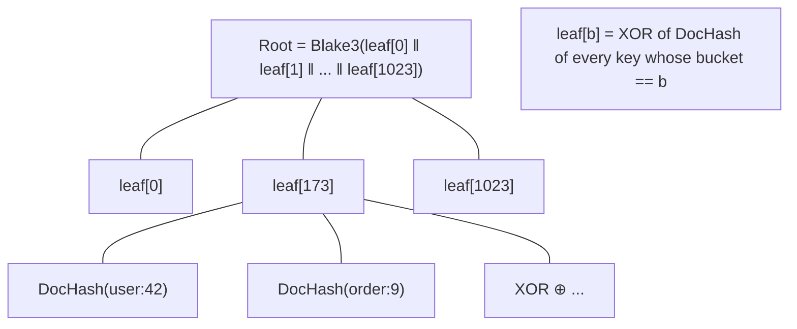
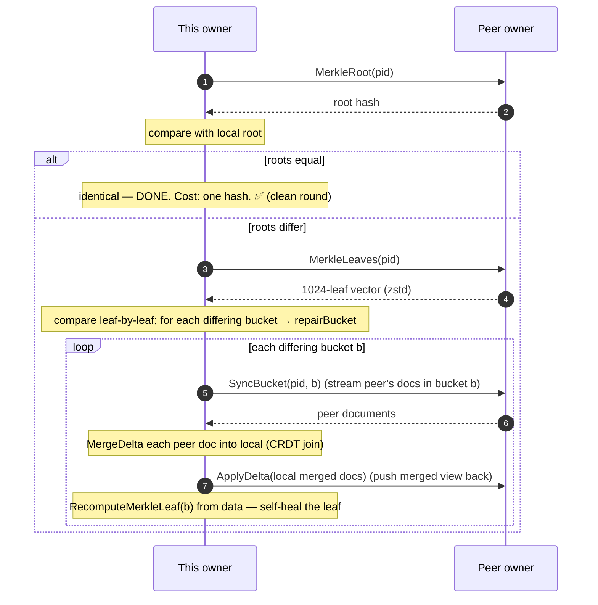

# 8. Anti-Entropy (Merkle Repair)

Replication (chapter 7) is fast but lossy: deltas get dropped under overload, lost
to network failures, or missed while a node was briefly away. **Anti-entropy** is
the background process that finds and fixes those gaps. It is the system's **only**
repair mechanism — there is no read repair and no durable replication log — so it
carries the entire weight of the "eventual" in eventual consistency.

Code: `internal/antientropy/engine.go`, `internal/merkle/merkle.go`.

## 8.1 The goal and the naive cost

"Entropy" here means **divergence**: two owners of the same partition holding
different data. Anti-entropy drives entropy back to zero by making owners
periodically compare and reconcile.

The naive way to compare two replicas is to send every key and value across and
diff them. For a partition with a million keys, that is enormous traffic *every
round* — utterly impractical when, almost always, the two replicas are **already
identical** and there is nothing to fix. What's needed is a way to confirm
identity in O(1), and to *localise* differences cheaply when they exist. That is
what a **Merkle tree** provides.

## 8.2 Merkle trees: comparing data by hashing

A **Merkle tree** is a tree of hashes. The leaves hash chunks of data; each
internal node hashes its children; the single **root** hash summarises everything.
The magic property: **if two trees have the same root hash, they hold identical
data** (modulo astronomically unlikely hash collisions). And if the roots differ,
the tree can be descended, comparing child hashes to *find exactly which chunks
differ*, without transferring the data itself.

convergeKV uses a deliberately **flat, two-level** tree per partition:

- **1024 leaf buckets.** Each key maps to a bucket via `Bucket(key) = xxhash(key) %
  1024` (`merkle.go:31`) — the same bucket embedded in the storage key (chapter 6).
- **Leaf hash = XOR of the document hashes in that bucket.** Each document
  contributes `DocHash(key, canonicalDoc)` — a Blake3 hash over the key *and the
  full canonical document* (`merkle.go:37`). The leaf is the XOR of all of them.
- **Root = Blake3 hash of the 1024-leaf vector** (`merkle.go:57`).



### Why XOR leaves?

Because it makes leaf maintenance **incremental and O(1)** on the write path. When a
document changes, there is no need to re-read its whole bucket; just XOR out its old
hash and XOR in its new one (chapter 6 §6.3). XOR is commutative and self-inverse
(`a ⊕ x ⊕ x = a`), so the leaf always equals the XOR of whatever documents are
currently in the bucket, regardless of update order. This is exactly why document
and leaf are written in the same atomic batch — they must stay in lockstep.

### Why hash the *full* document, not just the context?

An earlier approach hashed only the causal context. It was changed to the **full
canonical document** (`merkle.go:6`), and the reason is the multi-value-leaf design
from chapter 2: two replicas can hold the **same context** but **different register
subsets** for a field. A context-only hash would make that divergence *permanently
invisible* to anti-entropy — the one kind of divergence it exists to catch. Hashing
the whole document closes that hole. (The chaos test suite caught this.)

## 8.3 One round, with one peer

The engine runs rounds on a **jittered schedule** (`Run`, `engine.go:113`): roughly
every `AntiEntropyInterval` (default 45 s), with random jitter so owners don't all
sync in lockstep. Each round, for each owned partition, it exchanges with every
*other* owner. Here is one exchange (`exchange`, `engine.go:179`):



**The clean-round fast path is the whole point.** When two owners agree — the
overwhelmingly common case — the round costs exactly **one root hash exchanged per
peer**: O(1), independent of how many keys the partition holds. AE traffic for a
clean round is therefore O(tree depth), not O(keys): clean rounds never fetch
leaves at all (`leafFetches` stays zero — `engine.go:99`).

When roots differ, the engine fetches the whole 1024-leaf vector once (32 KiB,
zstd-compressed) and compares leaf by leaf to find the differing buckets. This is
the deliberate "flat tree" trade-off: instead of a multi-level descent, one fetch
localises all differences. At P ≤ 1024 buckets the bandwidth is negligible, and it
saves round-trips.

## 8.4 Repairing a bucket — bidirectional merge

`repairBucket` (`engine.go:219`) heals one divergent bucket in **both directions**:

1. **Pull the peer's documents** for that bucket via the streaming `SyncBucket` RPC,
   and `MergeDelta` each into local state. Because merge is a CRDT join (chapter 2),
   this is always safe regardless of what local already had. Each document that
   actually changed increments `keysRepaired`.
2. **Push the (now-merged) documents back** to the peer with `ApplyDelta`, so the
   peer converges to the same merged state. The peer's own `MergeDelta` keeps *its*
   leaf consistent.
3. **Self-heal the local leaf** with `RecomputeMerkleLeaf` (`coordinator.go:301`):
   rescan the bucket and rebuild the leaf from the documents themselves.

Why step 3? The incremental XOR leaf can, in rare cases (disk corruption, a bug),
**drift** out of sync with the actual documents — and an XOR leaf can't
self-correct, because it has no idea what it *should* be. After a repair,
recomputing the leaf straight from the data guarantees the leaf and documents agree
again. Bidirectional merge plus leaf recompute means that after one repair round
touching a bucket, both owners hold **byte-identical** documents and matching
leaves.

## 8.5 Clean rounds and the GC trigger

A round is **clean** when *every reachable peer* agreed on the root (no repairs, no
unreachable peers). The engine tracks consecutive clean rounds per partition
(`RunRound`, `engine.go:138`):

```go
if clean {
    e.cleanRounds[pid]++
} else {
    e.cleanRounds[pid] = 0   // any repair OR any unreachable peer resets it
}
// then notify GC: OnCleanRound(pid) or OnDirtyRound(pid)
```

Two subtle but vital rules:

- **An unreachable peer makes the round dirty**, not clean. "All owners agree"
  cannot be certified if one of them couldn't be reached. This is the linchpin of
  delete safety: if an owner is offline (maybe holding a stale pre-delete copy),
  clean rounds *freeze*, so garbage collection of deletes freezes too — nothing
  gets reaped while a node that might resurrect it is unreachable (chapter 10).
- **Dirty rounds notify GC to reset**, because the GC certification needs
  *consecutive* clean rounds (chapter 10 §10.4).

The clean-round count is what gates garbage collection: two consecutive clean
rounds certify that all owners are in sync, which is when it is safe to discard
deleted documents' residual contexts.

## 8.6 Putting it together: how a dropped delta heals

Tie this back to chapter 7. A write is applied on owner A; the fan-out to owner B
is dropped (B's queue overflowed). Now A has the new value, B doesn't —
divergence.

1. Next AE round, A and B exchange roots. They differ (the write changed A's leaf).
2. A fetches B's leaves, spots the one differing bucket.
3. `repairBucket`: A pulls B's docs (no change for this key — B is behind), pushes
   A's merged doc to B. B's `MergeDelta` adopts the write.
4. Both leaves recomputed; roots now match.
5. Next round is clean.

The dropped delta is healed within roughly one AE interval — which is exactly why
the interval must be **aggressive** (the default is 45 s, jittered), since it bounds
the worst-case staleness window for *everything* the fire-and-forget path misses.

## 8.7 Summary

- Anti-entropy is convergeKV's **sole** repair mechanism; replication is just a fast
  best-effort optimization on top of it.
- Each partition has a flat **Merkle tree**: 1024 XOR leaf buckets summarised by one
  root hash. Equal roots ⇒ identical data, confirmed in **O(1) per peer**.
- Leaves are maintained incrementally by XOR (cheap writes) and **recomputed from
  data after repairs** (self-healing drift). Leaves hash the **full document**, not
  just the context, to catch multi-value divergence.
- On root mismatch, one leaf-vector fetch localises differing buckets;
  `repairBucket` **merges both directions** (CRDT join) so both owners converge to
  byte-identical state.
- A round is **clean** only if every owner was reachable *and* agreed. Consecutive
  clean rounds gate garbage collection; an unreachable owner freezes it — the
  foundation of delete safety.

Next: [cluster changes (transfer)](09-transfer.md) — how data is moved when nodes
join, leave, or crash.
