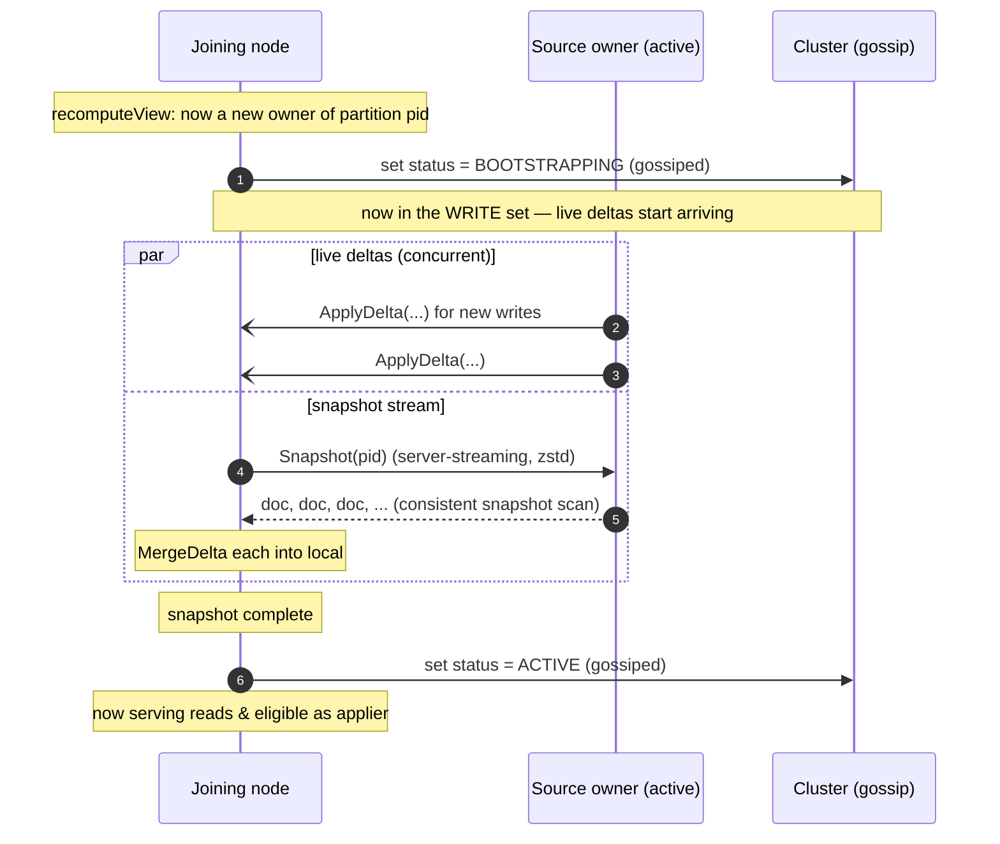
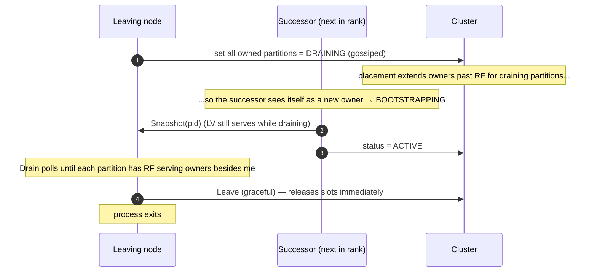
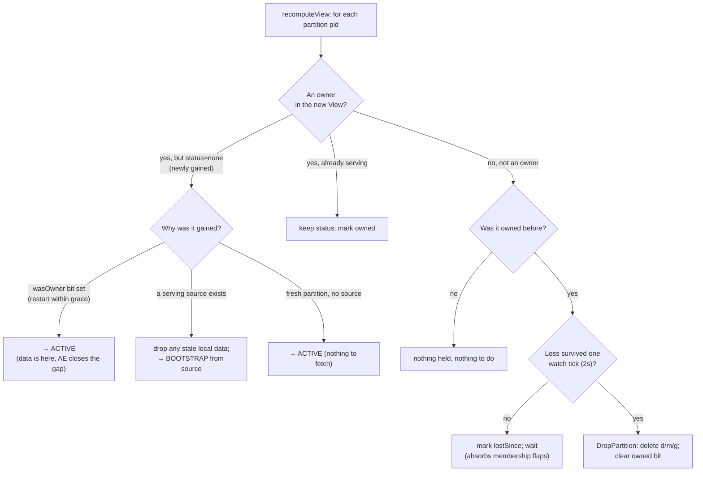

# 9. Cluster Changes (Transfer & Rebalancing)

When the set of nodes changes — someone joins, leaves on purpose, or crashes —
partition ownership shifts (chapter 4 recomputes the `View`). But ownership is just
a *label*; the **data** has to physically move to the node that now owns it. This
chapter is about that movement: **transfer** (bootstrapping a partition) and the
rebalancing dance around joins, planned leaves, and crashes.

Code: `internal/transfer/transfer.go`, and the reconciliation logic in
`internal/node/node.go` (`recomputeView`).

## 9.1 The three events

| Event | What changes | Data action |
|-------|--------------|-------------|
| **Join** | a new node appears; it becomes an owner of some partitions | new owner **bootstraps** each gained partition (streams a snapshot) |
| **Planned leave** | a node announces it's going | it **drains**: stays serving until successors are ready, then exits |
| **Crash** | a node vanishes without warning | it becomes a **dead phantom** for the grace period; if still gone after, a successor is promoted and bootstraps |

The unifying mechanism is the per-partition **status** (chapter 4):
`bootstrapping` → `active` → (`draining`) drives every transition, gossiped so
every node stays coordinated.

## 9.2 Bootstrap: filling a freshly-gained partition

When a node becomes an owner of a partition it doesn't have data for, it must
**bootstrap**: copy the partition's data from an existing owner. The tricky part is
doing this *while writes are still happening*, with zero downtime. convergeKV's
answer leans entirely on the CRDT merge being safe in any order:

The flow (`Manager.run`, `transfer.go:101`):

1. **Flip to `bootstrapping`** and gossip it. This immediately puts the node in the
   partition's **write set**, so live deltas for new writes start flowing in — *even
   though the bootstrap hasn't started.* The node is catching up on history and
   keeping current simultaneously.
2. **Pick a source** (`pickSource`, `transfer.go:131`): the highest-ranked *other*
   owner that is `active` or `draining`. If none exists (a brand-new partition no one
   has data for), skip straight to active.
3. **Stream a snapshot** via the `Snapshot` server-streaming RPC. The source does a
   consistent `ScanPartition` (chapter 6) and streams every document,
   zstd-compressed. The joiner `MergeDelta`s each one into local storage.
4. **Flip to `active`** and gossip it. Now it serves reads and can be applier.

**Why is the snapshot/live-delta overlap safe?** Because both paths funnel through
`MergeDelta`, which is the CRDT join (chapter 2). A live delta and a snapshot
document for the same key can arrive in *either* order, even both — merge is
commutative, associative, and idempotent, so the result is identical regardless. No
sequencing, no locking against the snapshot, no "freeze writes during transfer." The
CRDT makes a notoriously fiddly operation (online data migration) almost trivial.
This is one of the biggest practical payoffs of the whole CRDT design.

If a bootstrap fails midway, the manager rolls the status back to `none`
(`transfer.go:96`) so the node's `watch` loop retries on the next tick.

## 9.3 Join: scaling 3 → 5 nodes under load

When two nodes join a 3-node cluster, HRW (chapter 4) reassigns ownership so the
new nodes pick up roughly their fair share of partitions. For each partition a new
node gains, it runs the bootstrap above. Meanwhile, the *old* owners that are no
longer in the top-3 for some partition eventually **lose** ownership and drop that
data (§9.5). Because bootstrapping owners receive live writes the whole time and
HRW moves only the minimum necessary partitions, the design goal is **zero failed
reads or writes** during the scale-up.

## 9.4 Planned leave: draining

A graceful shutdown (`node.Stop(graceful=true)`) must not drop the partition's
replication factor even momentarily. So the leaver **drains** (`transfer.Drain`,
`transfer.go:145`):

1. The leaver sets every owned partition to `draining`. In `placement.Compute`, a
   draining owner causes the owner list to **extend past RF** (chapter 4 §4.5), so
   the *next-ranked* node now sees itself as an owner and starts bootstrapping —
   **while the leaver is still serving.**
2. `Drain` polls the view until every owned partition has the full RF of *other*
   active owners (`transfer.go:157`), i.e. the successors have finished
   bootstrapping. Only then does it stop waiting (or it times out after 15 s and
   leaves anyway).
3. The node broadcasts a **graceful leave** (`cluster.Leave`), which — unlike a
   crash — releases its placement slots *immediately* (no grace period; chapter 5).

The result: replication factor is maintained throughout. No partition ever drops
below its serving owners during a planned departure.

## 9.5 Crash: dead phantoms and delayed promotion

A crash is different: no warning, no draining. The cluster detects the death via
gossip (chapter 5) and the node becomes a **dead phantom** — it keeps its placement
slot for the **grace period** (default 10 min), serving nothing.

Why wait? To avoid a **transfer storm**. Promoting a successor the instant a node
looked dead would mean every transient blip — a node rebooting in 5 seconds, a brief
network hiccup — triggers a full partition bootstrap to a replacement, only for the
original to come right back. During the grace period the partition runs on its 2
surviving owners (RF temporarily 2), betting that most "deaths" are transient.

- **If the node returns within grace:** it reclaims its slot. Its on-disk data is
  still valid (deletes haven't been GC'd cluster-wide yet — see chapter 10), so it
  just needs to catch up on what it missed, which **anti-entropy does** over the
  next few rounds. **No bootstrap transfer at all** (the `wasOwner` shortcut,
  `node.go:337`).
- **If the grace period expires:** the dead phantom is pruned (chapter 5), HRW
  promotes the next-ranked node to restore RF=3, and *that* node bootstraps the
  partition fresh.

## 9.6 The reconciliation loop: where ownership becomes action

All of this is orchestrated by `node.recomputeView` (`node.go:323`), which runs on
every membership change (and a 2 s safety tick). For each partition it compares
"what status is currently advertised?" against "what should this node be, per the
new View?" and acts:

The two safety-critical branches:

- **Gained anew with a source → drop stale data, then bootstrap.** If this node has
  *any* leftover data for a partition it is gaining "fresh" (not a
  restart-within-grace), that leftover predates an ownership loss and **may be
  staler than cluster-wide GC** — merging it in could resurrect deleted documents.
  So it is dropped first, and the partition is bootstrapped clean from a current
  owner (`node.go:344`).
- **Lost ownership → drop the data, after a one-tick grace.** When a node stops
  being an owner, it doesn't delete immediately — a membership *flap* (lost and
  immediately regained) shouldn't cost a re-fetch. It marks `lostSince` and waits one
  watch tick; if the loss persists, it `DropPartition`s and clears the ownership bit
  (`node.go:371`). Keeping a stale copy around would be a resurrection risk, so the
  data genuinely must go.

The persisted **ownership bitmap** (`owned`, `node.go:57`) is the memory that makes
restart-within-grace cheap: a set bit means "current-enough data is held for this
partition that AE can close any gap," so on a quick restart the node activates
directly instead of bootstrapping. A bit is cleared only when the data is actually
dropped, keeping the bitmap honest.

## 9.7 Summary

- Ownership changes shift *labels*; **transfer** moves the actual data.
- **Bootstrap** streams a consistent snapshot from a source owner *while live deltas
  arrive concurrently* — safe because both go through the CRDT `MergeDelta`, which is
  order-independent. No write freeze. Status goes `bootstrapping` → `active`.
- **Planned leave** drains: the leaver keeps serving while successors bootstrap
  (placement extends past RF for draining owners), maintaining RF throughout.
- **Crash** uses **dead phantoms**: a grace period avoids transfer storms from
  transient failures; quick returns catch up via anti-entropy with no transfer, and
  only a truly-dead node triggers successor promotion + fresh bootstrap.
- `recomputeView` reconciles desired vs. actual status each membership change,
  **dropping stale data on ownership loss** and **bootstrapping clean on fresh
  gains** to prevent resurrection.

Next: [garbage collection & the resurrection problem](10-garbage-collection.md) —
the deepest correctness challenge in the system.
