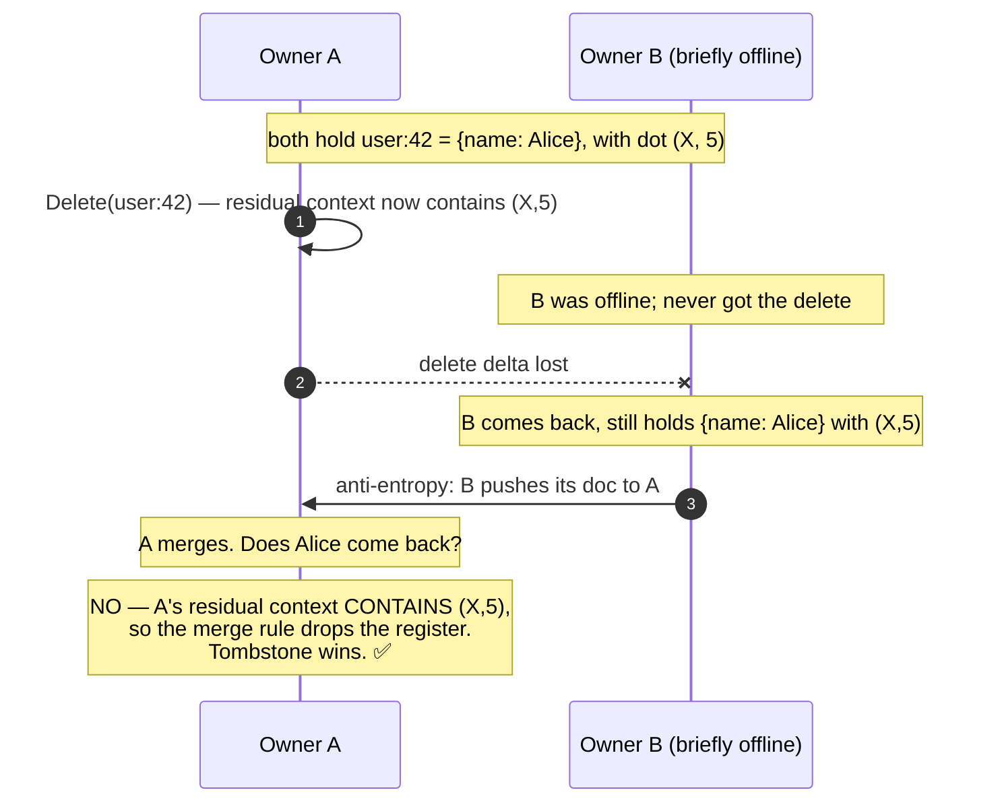
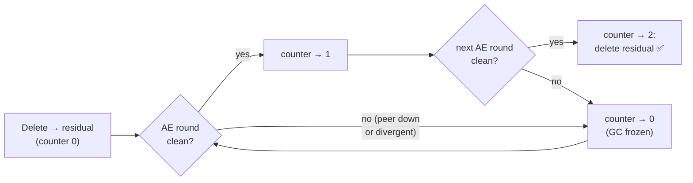

# 10. Garbage Collection & the Resurrection Problem

This chapter is about the single hardest thing a distributed, eventually-consistent
store has to get right: **making a delete stay deleted**, forever, while still being
able to throw away the bookkeeping that deletes leave behind. This is where the CRDT
machinery of chapter 2 earns its complexity.

Code: `internal/gc/reaper.go`, plus the GC entry points in
`internal/coordinator/coordinator.go`.

## 10.1 Why deletes leave garbage behind

Recall from chapter 2 that deleting a field (or document) doesn't erase it cleanly —
it leaves a **residual context**: an empty field set, but a causal context still
holding the dots of everything that was removed. That residual is a **tombstone**.
It reads as *not found*, but it must physically persist, because it is the *only*
thing that can stop a late-arriving write from resurrecting the deleted value.

Here is the resurrection scenario the tombstone defends against:



Without the residual context, A would have nothing — an empty record — and the merge
rule (chapter 2 §2.6) "remote has a register, its dot has never been seen → adopt
it" would **resurrect Alice**. The residual context is what turns "there is nothing"
into "there is *deliberately* nothing." This is the no-resurrection guarantee, and
the resurrection test is the core correctness claim of the whole design.

## 10.2 The tension: tombstones can't live forever

If residual contexts lived forever, every deleted key would leave a permanent
scar — storage growing without bound with the number of deletes ever performed,
inflating disk, canonical encodings, Merkle hashes, and transfers. They **must**
eventually be reclaimed. But reclaiming a tombstone is exactly *removing the thing
that prevents resurrection*. So the question is razor-sharp:

> When is it provably safe to discard a residual context — i.e. when can it be
> certain that **no replica anywhere** still holds a pre-delete copy that could come
> back to resurrect it?

The answer convergeKV uses: **when every owner has been proven to agree, for long
enough that no stale copy can still be in flight.** That proof comes from
anti-entropy.

## 10.3 Mechanism 1: residual-context reaping via clean rounds

The reaper (`gc.Reaper`) hooks into anti-entropy's clean-round signal (chapter 8).
The rule (`reaper.go:53`, `OnCleanRound`):

- Each **clean** AE round covering a partition, every residual document's
  per-key **`'g'` counter** is incremented.
- When the counter reaches **2** (`cleanRoundsToGC`, `reaper.go:25`), the residual is
  physically deleted — document, GC counter, and its Merkle leaf contribution all
  removed in one atomic batch (`GCDocument`, `coordinator.go:321`).

Why two *clean* rounds, and why does "clean" carry so much weight? Recall a round is
clean **only if every owner was reachable and agreed** (chapter 8 §8.5). So:

- If any owner is **offline** — possibly the very straggler holding a stale
  pre-delete copy — rounds are **not clean**, the counter doesn't advance, and GC
  **freezes**. The tombstone stays exactly as long as anyone who might resurrect the
  value is unreachable. This is the safety interlock.
- Two *consecutive* clean rounds (not just two ever) means all owners have been
  provably in sync across a span of time, so the delete has definitely reached
  everyone and no pre-delete copy survives.



### Making "consecutive" honest

There is a subtle bug the design has to avoid. The durable per-key `'g'` counter
survives across rounds — so a sequence like *clean (→1), dirty, clean (→2, reap)*
would wrongly certify with a dirty round in between. To enforce **consecutive**, a
dirty round wipes the partition's counters: `OnDirtyRound` (`reaper.go:105`) clears
all `'g'` counters for the partition. The engine calls `OnDirtyRound` whenever a
round isn't clean (`engine.go:167`). Now "counter == 2" genuinely means two
*adjacent* clean rounds.

This also explains the **`MaxAge < AntiEntropyInterval/2`** config rule from chapters
7 and 9. Two adjacent clean rounds can be as little as `interval/2` apart (the jitter
low bound). A stale `Put` delta still sitting in a peer's retry queue must be gone
before then — otherwise it could land *after* the residual was reaped and resurrect
the value. Bounding the retry queue's `MaxAge` below `interval/2` guarantees no
stale delta outlives the certification (`config.go:97`).

## 10.4 Mechanism 2: GC contagion (deleting faster, still safely)

Waiting two clean rounds per residual is correct but slow when there are many. GC
**contagion** propagates deletions opportunistically during repair. In
`repairBucket` (chapter 8), when syncing with a *fully-serving* peer, the engine
notes which keys the peer sent. Any residual *this* node holds that the **peer no
longer has** was already reaped by the peer's own GC — and the peer's GC required
byte-equality with this node — so it can be dropped immediately too (`OnPeerBucket`,
`reaper.go:115`), instead of pushing it back and freezing everyone's counters.

This is guarded carefully: contagion only applies when the peer is `active` or
`draining` (`engine.go:220`), never `bootstrapping` — a bootstrapping peer's bucket
may simply be *incomplete*, so its *absence* of a key certifies nothing.

## 10.5 Mechanism 3: actor retirement

The version vector inside a context maps **actor → highest seq**. Over a cluster's
lifetime, nodes come and go. A node that died long ago (past the grace period, and
not coming back) still has its `ActorID` lodged in the VVs of documents it ever
wrote. Those entries are dead weight — the actor will never mint another dot — but
they accumulate.

**Actor retirement** drops them. The rule (`RetireActors`, `coordinator.go:348`,
driven by `reaper.go`):

- An actor is **retirable** if it is not in `knownActors` — i.e. not alive and not
  dead-within-grace (`node.knownActors`, `node.go:482`).
- Its VV/cloud entries are dropped from a document's context **only if it has no live
  register** in that document (an actor whose value is still held cannot be retired).
- Like residual GC, this is certified by clean rounds and spread by contagion
  (`OnPeerDoc`, `reaper.go:141`): if a synced, byte-equal peer's copy already lacks
  the actor's entry, the local copy drops it too.

### Why retirement needs the wipe-and-rotate rule

Here is the deep connection to chapter 11. Suppose actor X is retired cluster-wide —
every context forgets it. Then the *physical machine* that was X reboots (it was just
slow, or its disk outlived the grace period) and starts minting **new** dots as X
again, say `(X, 50)`. Catastrophe: peers retired the X prefix, so they can never
compact `(X, 50)` — the contiguous run starting at 1 is gone forever — and the dot
sits in clouds permanently, growing without bound.

The defense: a node whose **liveness lease expired** (it was gone past the grace
period) **wipes its data and rotates to a brand-new identity** on restart (chapter
11). It re-enters as a never-before-seen actor that has minted nothing, so there is
no retired prefix to collide with. Retirement and identity-rotation are two halves of
one invariant: *a retired actor must never mint again.*

## 10.6 The monotonicity that prevents ping-pong

A worry: owners run GC independently and might be at slightly different stages — A
reaped a residual, B hasn't yet. Won't B's copy push back to A and un-reap it,
forever ping-ponging?

No, because the GC predicates are **monotone** and merge is a join. Once A has
dropped a residual under certification, B is either also certified (and drops it too,
via contagion or its own clean rounds) or B's copy, when pushed to A, carries a
context A's tombstone already covered — so A's merge correctly keeps it gone. The
transient asymmetry *self-heals* rather than oscillating. The `gc` package comment
(`reaper.go:1`) states this explicitly: monotone predicates mean the difference while
owners GC at slightly different times converges instead of ping-ponging.

## 10.7 The absorbing rule: one more anti-ping-pong guard

There is a related edge case in `MergeDelta` (`coordinator.go:272`). If a node holds
**nothing** for a key (never saw it, or already GC'd it) and receives a delta that is
**only a residual context** (empty fields), it **drops the delta** rather than
re-creating the residual:

```go
if doc == nil && len(delta.Fields) == 0 {
    return false, nil   // absorbing GC rule
}
```

Without this, a node that had reaped a residual would keep re-creating it from peers
who haven't reaped yet, freezing everyone's GC forever. The cost is tiny and bounded:
a node that *never saw the document* loses the residual's protection against a stale
in-flight put — but that window is bounded by the retry queue's `MaxAge` and healed
by anti-entropy. This is a deliberate deviation from pure join semantics, justified
in the code comment, and it is the right call.

## 10.8 Summary

- Deletes leave a **residual context** (tombstone): empty fields, but a context that
  prevents resurrection by making the merge rule drop any re-arriving old value.
- Tombstones can't live forever (unbounded growth), but reaping one removes the
  resurrection guard — so reaping must be **provably safe**.
- **Residual reaping** waits for **2 consecutive clean anti-entropy rounds**. "Clean"
  requires every owner reachable and in sync, so an offline node (a potential
  resurrector) **freezes GC**. Dirty rounds reset the per-key counter to keep
  "consecutive" honest; `MaxAge < interval/2` keeps stale deltas from outliving
  certification.
- **GC contagion** speeds deletion safely by dropping residuals a synced,
  fully-serving peer has already reaped.
- **Actor retirement** drops dead actors' VV entries once certified; paired with the
  **wipe-and-rotate** rule so a retired actor can never mint again and bloat clouds.
- **Monotone predicates** and the **absorbing rule** prevent GC ping-pong between
  owners at different stages.

Next: [node lifecycle & failure handling](11-lifecycle.md) — startup wiring,
shutdown, and the crash-recovery rules that several earlier chapters depend on.
