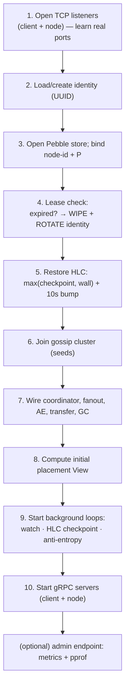
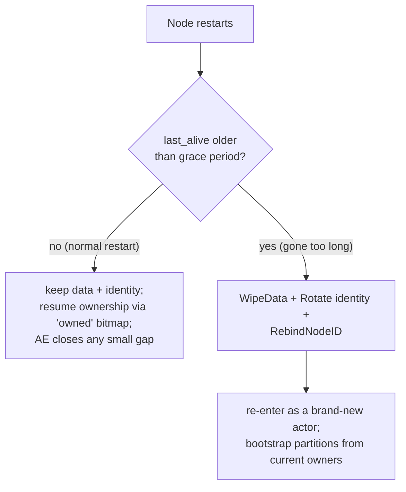

# 11. Node Lifecycle & Failure Handling

This final chapter ties the subsystems together at the level of a single node's
life: how it starts up and wires everything, how it shuts down cleanly, and the
crash-recovery rules that chapters 3, 9, and 10 kept referring to. It is also a
good place to see how the abstract guarantees are made robust against the messy
reality of processes dying at the worst possible moment.

Code: `cmd/kvnode/main.go`, `internal/node/node.go`, `internal/identity/identity.go`,
`internal/config/config.go`.

## 11.1 The binary

`cmd/kvnode/main.go` is tiny — it loads config, sets up logging, starts a node, and
waits for a termination signal:

```go
// cmd/kvnode/main.go (abridged)
cfg, _ := config.Load()                 // CONVERGEKV_* env vars
setupLogging(cfg.LogLevel)              // JSON slog to stderr
n, _ := node.Start(cfg, slog.Default())
ctx, stop := signal.NotifyContext(ctx, SIGINT, SIGTERM)
<-ctx.Done()                            // block until Ctrl-C / kill
n.Stop(true)                            // graceful shutdown
```

Configuration is **environment-only**, parsed from `CONVERGEKV_*` variables into a
struct via `caarlos0/env` (`config.go`). `config.Default()` supplies sensible
defaults (P=256, AE interval 45 s, etc.), `Load()` overlays the environment, and
`validate()` enforces the hard constraints seen earlier: `P` a power of two ≤ 1024,
and `AntiEntropyInterval/2 > ReplicationMaxAge` (the delete-safety bound from
chapter 10). A bad config fails startup loudly rather than running a subtly-broken
node.

## 11.2 Startup: ordered wiring with a cleanup stack

`node.Start` (`node.go:74`) brings a node fully up, in an order that matters, and —
importantly — **unwinds cleanly if any step fails**. Because startup acquires
resources incrementally (listeners, then the database, then gossip, then servers), a
failure halfway through must release what was already acquired or the process (and,
in tests, the in-process harness) would leak file handles, ports, and goroutines.

The pattern is a **deferred cleanup stack** (`node.go:79`):

```go
var cleanups []func()
started := false
defer func() {
    if started { return }                 // success: disarm
    for i := len(cleanups) - 1; i >= 0; i-- {
        cleanups[i]()                      // failure: unwind in reverse
    }
}()
// ... each acquired resource appends its closer to cleanups ...
started = true                             // last line: hand ownership to Stop
```

The startup order:



A few "why this order" notes:

- **Listeners first.** Binding to port `:0` lets the OS pick a free port; the node
  then reads back the *real* address to gossip to peers. The test harness relies on
  this to run many nodes on one machine.
- **Identity before store-bind.** The store *binds* to the node's UUID (chapter 6),
  rejecting a foreign data directory. Identity must exist first.
- **Lease check before everything data-related.** This is the crash-recovery gate
  (§11.4); it may wipe and rotate before the node is allowed to participate.
- **Gossip before serving.** The node needs a membership view to compute placement
  before it answers requests.

## 11.3 The running node: background loops

Once up, a node runs a few background goroutines (all tracked in a `WaitGroup` so
shutdown can wait for them, `node.bg`):

- **`watch`** (`node.go:301`) — the reconciliation loop. Waits on the cluster change
  signal (chapter 5) and a 2 s safety tick; on either, calls `recomputeView`
  (chapter 9) to recompute placement and reconcile ownership/status, drive
  bootstraps, drop lost partitions, and evict departed peers' connections/queues.
- **`checkpointHLC`** (`node.go:462`) — every `min(1s, grace/4)`, persists the HLC
  checkpoint (chapter 3) *and* the **liveness lease** heartbeat (§11.4). The interval
  is deliberately a fraction of the grace period so an ordinary restart never looks
  lease-expired.
- **`AE.Run`** (chapter 8) — the jittered anti-entropy scheduler.

## 11.4 The liveness lease: the crash-recovery gate

This is the rule chapters 9 and 10 leaned on. A node periodically writes a
**`last_alive`** timestamp to disk (`PersistLastAlive`). On startup, it checks how
old that timestamp is (`node.go:125`):

```go
if !lastAlive.IsZero() && time.Since(lastAlive) > cfg.CrashGracePeriod {
    // gone longer than the grace period:
    store.WipeData()                       // delete all docs/leaves/GC/ownership
    id = identity.Rotate(dataDir)          // brand-new UUID
    store.RebindNodeID(id)                 // re-pin the store to it
}
store.PersistLastAlive(time.Now())         // fresh heartbeat
```

The logic: if a node was gone *longer than the grace period*, the cluster has already
moved on without it — successors were promoted (chapter 9), and worse, **deleted data
may have been garbage-collected cluster-wide** (chapter 10) and **this actor may have
been retired** from causal contexts. If such a node rejoined with its old data and
old identity, it could:

1. **Resurrect deletes** — its stale documents predate the cluster's GC, so pushing
   them via anti-entropy would re-create deleted keys.
2. **Bloat clouds forever** — minting new dots under a retired actor ID that peers can
   never compact (chapter 10 §10.5).

So a lease-expired node must **forget everything and come back as a stranger**: wipe
the data, rotate to a fresh UUID. It then bootstraps partitions cleanly from current
owners like any new node. This wipe-and-rotate pairing is non-negotiable — the store
comment (`store.go:230`) and identity comment (`identity.go:48`) both call out that
one without the other is unsafe.



Contrast the two restart paths, both of which earlier chapters referenced:

- **Restart within grace** → keep everything. The persisted **ownership bitmap**
  (`owned`) lets the node re-activate its old partitions directly, with anti-entropy
  closing whatever small gap accumulated — **no transfer storm** (chapter 9 §9.5).
- **Restart after grace** → wipe and rotate, bootstrap fresh.

## 11.5 Shutdown: graceful vs. crash

`node.Stop(graceful)` (`node.go:252`) handles both an orderly exit and a simulated
crash (the test harness uses `graceful=false` to model a hard kill):

**Graceful** (`graceful=true`):

1. **Drain** every owned partition (chapter 9 §9.4): mark draining, wait for
   successors to go active, so RF is preserved.
2. Cancel the background context (stops `watch`, AE, checkpointing).
3. **Announce a leave** over gossip (`cluster.Leave`), releasing placement slots
   *immediately* (no grace period — this was intentional).
4. Gracefully stop the gRPC servers (let in-flight handlers finish, hard-stop after a
   5 s timeout), close the fan-out and connection pool.
5. Wait for all background goroutines to exit, persist a final HLC checkpoint, close
   the store.

**Crash** (`graceful=false`): skip drain and the leave announcement — the node just
vanishes (`cluster.Shutdown` stops gossip without a word). Peers detect the silence
via SWIM and treat it as a death, holding its slot through the grace period (chapter
5/9).

The careful ordering at the end matters for correctness: gRPC servers are stopped
**before** the store closes (in-flight handlers touch the store), and *all* background
goroutines are joined **before** the store closes (they touch it too). Getting this
wrong would risk a use-after-close. A design goal here is **zero leaked goroutines**,
verified with `go.uber.org/goleak`.

## 11.6 Identity: stable across restarts, rotated only on lease expiry

`internal/identity` keeps the node's UUID in a `node_id` file in the data directory,
written with an **atomic rename after fsync** (`writeAtomic`, `identity.go:63`) so a
crash mid-write can't leave a half-written ID. `LoadOrCreate` returns the existing ID
or mints one on first start. The 16 raw bytes of this UUID *are* the CRDT `ActorID`
(chapter 2) — identity, membership, and the CRDT all key off the same value. It is
**never derived from IP address**, so a node keeps its identity (and its data, and
its dot history) across restarts and network changes. The *only* time it changes is
`Rotate`, under the lease-expiry rule above.

## 11.7 Observability

When `AdminAddr` is set, the node serves a Prometheus `/metrics` endpoint plus pprof
(`internal/metrics/metrics.go`). The metrics are **pull-based collectors** that read
live atomic counters the hot paths already maintain — so exposing them adds no cost to
the write path. The exported series map directly onto things these chapters discussed:

| Metric | Meaning | Chapter |
|--------|---------|---------|
| `deltas_dropped_total` | replication deltas shed (overflow/age) | 7 |
| `retry_queue_depth{peer}` | per-peer fan-out backlog | 7 |
| `delta_lag_seconds{peer}` | age of the delta currently being delivered | 7 |
| `ae_keys_repaired_total` | documents fixed by anti-entropy | 8 |
| `ae_root_checks_total` / `ae_leaf_fetches_total` | AE round cost (leaf fetches stay 0 when clean) | 8 |
| `transfer_bytes_total` / `transfers_started_total` | bootstrap activity | 9 |
| `membership_members` / `membership_generation` | gossip view | 5 |

These let an operator *see* the invariants holding: leaf fetches near zero in
steady state (clean rounds), drops healed by repairs, transfers only on real churn.

## 11.8 Summary

- The **binary** is thin: load env config, start the node, wait for a signal, stop.
  Config is validated up front (P, and the AE-vs-MaxAge delete-safety bound).
- **Startup** wires resources in a dependency order behind a **deferred cleanup
  stack** that unwinds on any failure — no leaked ports, handles, or goroutines.
- A node keeps a **liveness lease** (`last_alive`); a restart *after* the grace period
  triggers **wipe + identity rotation** to prevent resurrection and cloud bloat, while
  a restart *within* grace resumes cheaply via the persisted ownership bitmap.
- **Shutdown** is graceful (drain → leave → stop, preserving RF) or crash-like (vanish,
  let SWIM notice), with strict teardown ordering so nothing touches a closed store.
- **Identity** is a persisted UUID = ActorID, stable across restarts, never from IP,
  rotated only on lease expiry.
- **Metrics + pprof** expose the live counters so the invariants are observable.

---

That is the whole system. To recap the throughline: a **causal CRDT** (ch. 2) makes
concurrent, out-of-order, duplicated updates always converge; **HLC** (ch. 3) breaks
ties; **HRW placement** (ch. 4) and **gossip** (ch. 5) let every node agree on who
owns what with no coordinator; **Pebble** (ch. 6) stores it durably with the Merkle
leaf in lockstep; the **request paths** (ch. 7) keep writes fast and quorum-free;
**anti-entropy** (ch. 8) is the single backstop that heals everything the fast path
drops; **transfer** (ch. 9) moves data on churn without downtime; **garbage
collection** (ch. 10) keeps deletes dead while reclaiming tombstones safely; and the
**lifecycle** rules (ch. 11) make all of it survive processes dying at the worst
possible moment. Every piece exists to serve the convergence guarantee at the center.

Back to the [overview](01-overview.md).
